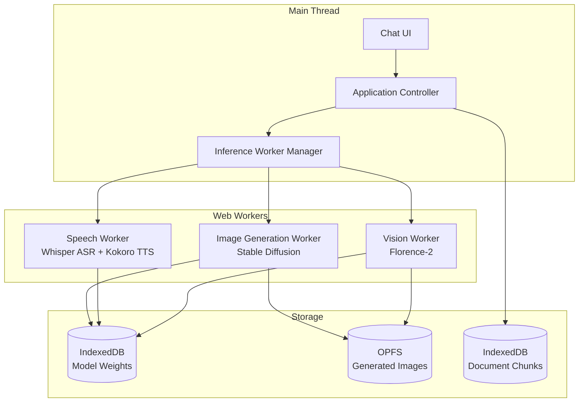

# Design Document: Multimodal Support

## Overview

The Multimodal Support feature extends the Local AI Assistant with image generation, speech input/output, document ingestion with RAG, and image understanding capabilities. All multimodal inference leverages WebGPU for hardware acceleration and executes in Web Workers to maintain UI responsiveness. The architecture prioritizes privacy by processing all data locally on the user's device, with no external API calls for multimodal operations.

The system uses a worker-based architecture where heavy ML models (Stable Diffusion, Whisper, Kokoro TTS, Florence-2) run in dedicated Web Workers with WebGPU contexts. This prevents UI blocking during inference and allows for efficient GPU memory management. Model weights are progressively loaded and cached in IndexedDB for fast subsequent access.

## Architecture

### High-Level Multimodal Architecture



### Component Responsibilities

**Inference Worker Manager**
- Manages lifecycle of Web Workers for different model types
- Implements worker pool with maximum 2 concurrent workers
- Handles progress callbacks and cancellation via AbortController
- Coordinates GPU memory allocation across workers

**Image Generation Worker**
- Loads and executes Stable Diffusion model via WebGPU
- Implements progressive diffusion with step-by-step progress reporting
- Caches model weights in IndexedDB for fast subsequent loads
- Renders final image to canvas and saves to OPFS

**Speech Worker**
- Loads Whisper ASR model for speech-to-text
- Loads Kokoro TTS model for text-to-speech
- Processes audio input from MediaDevices API
- Generates audio output for browser playback

**Vision Worker**
- Loads Florence-2 vision model via WebGPU
- Generates image captions and descriptions
- Detects objects and generates bounding box coordinates
- Processes uploaded images for question answering

**RAG Processor**
- Chunks uploaded documents with overlap
- Stores chunks in IndexedDB with full-text search indices
- Retrieves relevant chunks using keyword matching
- Injects retrieved context into prompts with citations

## Components and Interfaces

### 1. InferenceWorkerManager

**Purpose:** Manages Web Workers for GPU-accelerated model inference.

**Interface:**
```typescript
interface InferenceWorkerManager {
  // Initialize worker with model type
  initializeWorker(modelType: ModelType): Promise<WorkerHandle>;
  
  // Execute inference task
  runInference(handle: WorkerHandle, task: InferenceTask): Promise<InferenceResult>;
  
  // Monitor progress for long-running tasks
  onProgress(callback: (progress: ProgressUpdate) => void): void;
  
  // Cancel ongoing inference
  cancelInference(handle: WorkerHandle): Promise<void>;
  
  // Terminate worker and free resources
  terminateWorker(handle: WorkerHandle): Promise<void>;
  
  // Get active worker count
  getActiveWorkerCount(): number;
}

type ModelType = 'image-generation' | 'vision' | 'speech-asr' | 'speech-tts';

interface WorkerHandle {
  id: string;
  type: ModelType;
  status: 'initializing' | 'ready' | 'busy' | 'terminated';
}

interface InferenceTask {
  type: ModelType;
  input: string | Blob | ArrayBuffer;
  parameters: Record<string, any>;
  abortSignal?: AbortSignal;
}

interface InferenceResult {
  type: ModelType;
  output: string | Blob | ArrayBuffer;
  metadata: {
    inferenceTimeMs: number;
    modelVersion?: string;
    [key: string]: any;
  };
}

interface ProgressUpdate {
  workerId: string;
  phase: string;
  percentage: number;
  message?: string;
}
```

**Key Behaviors:**
- Maintains pool of maximum 2 concurrent workers to prevent memory exhaustion
- Queues inference tasks when all workers are busy
- Implements progressive model weight loading with caching
- Uses SharedArrayBuffer for zero-copy data transfer when available
- Monitors GPU memory usage via WebGPU adapter queries
- Automatically terminates idle workers after 5 minutes

### 2. ImageGenerationWorker

**Purpose:** Executes Stable Diffusion model for text-to-image generation.

**Interface:**
```typescript
// Worker message interface
interface ImageGenerationMessage {
  type: 'initialize' | 'generate' | 'cancel';
  payload: {
    prompt?: string;
    negativePrompt?: string;
    steps?: number;
    guidanceScale?: number;
    seed?: number;
  };
}

interface ImageGenerationResponse {
  type: 'progress' | 'complete' | 'error';
  payload: {
    step?: number;
    totalSteps?: number;
    imageBlob?: Blob;
    error?: string;
  };
}
```

**Key Behaviors:**
- Loads Stable Diffusion 1.5 or 2.1 model weights from IndexedDB cache
- Implements diffusion loop with configurable steps (default 20)
- Reports progress after each diffusion step
- Supports negative prompts for better control
- Generates 512x512 images by default (configurable based on VRAM)
- Uses classifier-free guidance for improved quality
- Saves generated images to OPFS with metadata

### 3. SpeechWorker

**Purpose:** Handles speech-to-text (ASR) and text-to-speech (TTS) operations.

**Interface:**
```typescript
// Worker message interface
interface SpeechMessage {
  type: 'initialize-asr' | 'initialize-tts' | 'transcribe' | 'synthesize' | 'cancel';
  payload: {
    audioData?: ArrayBuffer;
    text?: string;
    language?: string;
    voice?: string;
  };
}

interface SpeechResponse {
  type: 'progress' | 'transcription' | 'audio' | 'error';
  payload: {
    transcription?: string;
    audioBlob?: Blob;
    progress?: number;
    error?: string;
  };
}
```

**Key Behaviors:**
- Loads Whisper Tiny model for ASR (39MB, fast inference)
- Loads Kokoro-82M model for TTS (82MB, natural voice)
- Processes audio in chunks for real-time transcription
- Supports multiple languages for ASR (auto-detect or specified)
- Generates natural-sounding speech with configurable voice
- Caches model weights in IndexedDB for fast subsequent loads

### 4. VisionWorker

**Purpose:** Executes Florence-2 vision model for image understanding.

**Interface:**
```typescript
// Worker message interface
interface VisionMessage {
  type: 'initialize' | 'analyze' | 'detect-objects' | 'cancel';
  payload: {
    imageData?: ArrayBuffer;
    task?: 'caption' | 'detailed-caption' | 'object-detection' | 'ocr';
  };
}

interface VisionResponse {
  type: 'progress' | 'analysis' | 'error';
  payload: {
    caption?: string;
    objects?: DetectedObject[];
    text?: string;
    progress?: number;
    error?: string;
  };
}

interface DetectedObject {
  label: string;
  confidence: number;
  boundingBox: {
    x: number;
    y: number;
    width: number;
    height: number;
  };
}
```

**Key Behaviors:**
- Loads Florence-2 Base model (232MB) via WebGPU
- Generates detailed image captions and descriptions
- Detects objects with bounding boxes and confidence scores
- Performs OCR on images with text
- Supports multiple vision tasks (caption, detection, OCR)
- Caches model weights in IndexedDB for fast subsequent loads

### 5. RAGProcessor

**Purpose:** Implements document ingestion and retrieval for context-aware responses.

**Interface:**
```typescript
interface RAGProcessor {
  // Ingest a document and create searchable chunks
  ingestDocument(file: File): Promise<DocumentHandle>;
  
  // Retrieve relevant chunks for a query
  retrieveContext(query: string, documentIds: string[]): Promise<Chunk[]>;
  
  // Delete a document and its chunks
  deleteDocument(documentId: string): Promise<void>;
  
  // List all ingested documents
  listDocuments(): Promise<DocumentMetadata[]>;
}

interface DocumentHandle {
  id: string;
  filename: string;
  chunkCount: number;
  sizeBytes: number;
  uploadedAt: number;
}

interface Chunk {
  id: string;
  documentId: string;
  content: string;
  startOffset: number;
  endOffset: number;
  relevanceScore: number;
}

interface DocumentMetadata {
  id: string;
  filename: string;
  chunkCount: number;
  sizeBytes: number;
  uploadedAt: number;
}
```

**Key Behaviors:**
- Chunks documents into 512-token segments with 50-token overlap
- Uses simple keyword matching for retrieval (no embeddings)
- Stores chunks in IndexedDB with full-text search indices
- Limits context injection to top 3 most relevant chunks
- Includes source citations in generated responses
- Supports multiple document formats (txt, md, pdf via text extraction)

## Data Models

### Model Cache Schema (IndexedDB)

```typescript
// Object Store: modelWeights
interface ModelWeightEntry {
  modelId: string;              // Primary key
  modelType: ModelType;
  version: string;
  weights: ArrayBuffer;         // Serialized model weights
  sizeBytes: number;
  cachedAt: number;             // Unix timestamp
  lastUsed: number;             // Unix timestamp
}
```

### Document Storage Schema (IndexedDB)

```typescript
// Object Store: documents
interface DocumentEntry {
  id: string;                   // Primary key (UUID)
  filename: string;
  content: string;              // Full document text
  sizeBytes: number;
  uploadedAt: number;
  metadata: {
    mimeType: string;
    encoding: string;
  };
}

// Object Store: chunks
interface ChunkEntry {
  id: string;                   // Primary key (UUID)
  documentId: string;           // Foreign key to documents
  content: string;              // Chunk text
  startOffset: number;          // Character offset in original document
  endOffset: number;            // Character offset in original document
  tokenCount: number;
  keywords: string[];           // Extracted keywords for search
}
```

### Asset Storage Schema (OPFS)

```typescript
// File path: /images/{imageId}.png
interface GeneratedImage {
  id: string;
  prompt: string;
  negativePrompt?: string;
  parameters: {
    steps: number;
    guidanceScale: number;
    seed: number;
  };
  generatedAt: number;
  sizeBytes: number;
}

// File path: /audio/{audioId}.wav
interface GeneratedAudio {
  id: string;
  text: string;
  voice: string;
  generatedAt: number;
  durationMs: number;
  sizeBytes: number;
}
```

## Error Handling

### Error Categories and Recovery Strategies

**1. GPU Memory Exhaustion**
- **Cause:** Insufficient VRAM for model loading or inference
- **Detection:** WebGPU throws `GPUOutOfMemoryError`
- **Recovery:** Terminate worker, reduce model size or resolution, retry
- **User Action Required:** Optional (suggest closing tabs or reducing quality)

**2. Model Loading Failures**
- **Cause:** Corrupted cache, network issues during initial download
- **Detection:** Model initialization throws error
- **Recovery:** Clear model cache, re-download weights
- **User Action Required:** Yes (confirm re-download)

**3. Worker Timeout**
- **Cause:** Inference taking too long (>120s for images, >60s for speech)
- **Detection:** Custom timeout wrapper
- **Recovery:** Cancel inference, suggest reducing complexity
- **User Action Required:** Yes

**4. Audio Capture Failures**
- **Cause:** Microphone permission denied or device unavailable
- **Detection:** MediaDevices API throws error
- **Recovery:** Display permission request, fallback to text input
- **User Action Required:** Yes (grant permission)

**5. Document Parsing Errors**
- **Cause:** Unsupported file format or corrupted file
- **Detection:** File API or text extraction throws error
- **Recovery:** Display error message, suggest supported formats
- **User Action Required:** Yes (upload different file)

## Testing Strategy

### Dual Testing Approach

The Multimodal Support feature requires both **unit tests** and **property-based tests** to ensure correctness across diverse inputs and hardware configurations.

**Unit Tests** focus on:
- Specific examples (e.g., "generating image with specific prompt produces valid blob")
- Edge cases (e.g., empty prompts, corrupted audio, malformed documents)
- Integration points (e.g., worker communication, storage operations)
- Error conditions (e.g., GPU unavailable, quota exceeded)

**Property-Based Tests** focus on:
- Universal properties (e.g., "for any valid prompt, image generation produces a valid blob")
- Comprehensive input coverage through randomization
- Invariants (e.g., "chunk count equals actual chunks stored")

### Property-Based Testing Configuration

**Framework:** fast-check (TypeScript/JavaScript standard PBT library)

**Configuration:**
- Minimum 100 iterations per property test
- Tag format: `// Feature: multimodal-support, Property N: <property text>`
- Tests run in both Node.js (for CI) and browser (for WebGPU tests)

**Test Organization:**
```
tests/
├── unit/
│   ├── inference-worker-manager.test.ts
│   ├── image-generation.test.ts
│   ├── speech-processing.test.ts
│   ├── vision-analysis.test.ts
│   └── rag-processor.test.ts
├── properties/
│   ├── worker-properties.test.ts
│   ├── image-generation-properties.test.ts
│   ├── speech-properties.test.ts
│   ├── vision-properties.test.ts
│   └── rag-properties.test.ts
└── integration/
    └── multimodal-end-to-end.test.ts
```

### Testing Challenges

**Challenge 1: WebGPU Availability**
- WebGPU not available in Node.js test environments
- **Solution:** Use conditional test execution with `test.skipIf(!navigator.gpu)`
- **Solution:** Mock WebGPU adapter for unit tests, use real GPU for integration tests

**Challenge 2: Model Weight Size**
- Models are large (39MB-232MB), slow to download in tests
- **Solution:** Use tiny test models or mock model loading
- **Solution:** Cache models in CI environment for faster test runs

**Challenge 3: Non-Deterministic Inference**
- Image generation and speech synthesis vary between runs
- **Solution:** Test structural properties (e.g., "output is valid blob") not exact content
- **Solution:** Use fixed seeds for image generation when testing

**Challenge 4: Audio Device Access**
- Microphone not available in headless test environments
- **Solution:** Mock MediaDevices API for unit tests
- **Solution:** Skip audio capture tests in CI, run manually

## Correctness Properties

*A property is a characteristic or behavior that should hold true across all valid executions of a system—essentially, a formal statement about what the system should do. Properties serve as the bridge between human-readable specifications and machine-verifiable correctness guarantees.*

### Property 1: Worker Non-Blocking Execution

*For any* inference task (image generation, speech processing, vision analysis), executing the task in a worker should not block the main thread, keeping the UI responsive.

**Validates: Requirements 1.3, 2.2, 3.5**

### Property 2: Worker Pool Limit

*For any* sequence of worker initialization requests, the number of active workers should never exceed 2.

**Validates: Requirements 1.4**

### Property 3: Worker Cancellation

*For any* active inference task, calling cancelInference should terminate the task and free the worker.

**Validates: Requirements 1.6**

### Property 4: Image Generation Output Validity

*For any* valid text prompt, image generation should produce a valid image blob that can be rendered to a canvas element.

**Validates: Requirements 2.4, 2.5**

### Property 5: Image Generation Progress Reporting

*For any* image generation task, progress updates should be emitted for each diffusion step, with percentage increasing monotonically from 0 to 100.

**Validates: Requirements 2.3**

### Property 6: Hardware-Based Image Generation Gating

*For any* hardware profile with VRAM below 4 GB, attempting to enable image generation should display a hardware limitation message and prevent activation.

**Validates: Requirements 2.6**

### Property 7: Audio Transcription Output

*For any* audio input captured from MediaDevices API, the ASR model should produce a non-empty text transcription.

**Validates: Requirements 3.2, 3.3**

### Property 8: TTS Audio Output

*For any* non-empty text input with voice output enabled, the TTS model should generate a valid audio blob that can be played through the browser.

**Validates: Requirements 3.4, 3.6**

### Property 9: Document Chunking Validity

*For any* uploaded text document, the chunking algorithm should produce chunks that are all within the maximum token limit (512 tokens) and have appropriate overlap (50 tokens) between consecutive chunks.

**Validates: Requirements 4.2**

### Property 10: Document Storage Round-Trip

*For any* uploaded document, storing it then immediately retrieving it should return content equivalent to the original.

**Validates: Requirements 4.6**

### Property 11: Retrieval Relevance

*For any* query against uploaded documents, all retrieved chunks should contain at least one keyword from the query (basic relevance criterion).

**Validates: Requirements 4.3**

### Property 12: Context Injection Completeness

*For any* response generated with document context, the prompt sent to the model should include the retrieved chunks.

**Validates: Requirements 4.4**

### Property 13: Source Citation Presence

*For any* response generated using document context, the response should include citations to the source document and chunk location.

**Validates: Requirements 4.5**

### Property 14: Vision Model Output

*For any* uploaded image, the vision model should generate a non-empty caption or description.

**Validates: Requirements 5.2**

### Property 15: Vision Context Injection

*For any* question about an uploaded image, the prompt sent to the model should include the image analysis.

**Validates: Requirements 5.3**

### Property 16: Object Detection Visualization

*For any* image with detected objects, bounding boxes should be rendered as visual overlays with coordinates matching the detection output.

**Validates: Requirements 5.5**

### Property 17: Image Storage Round-Trip

*For any* uploaded or generated image, storing it in OPFS then immediately retrieving it should return a blob equivalent to the original.

**Validates: Requirements 5.6**

### Edge Cases

The following edge cases should be handled gracefully:

- **Empty Prompts**: Attempting to generate images with empty prompts should be prevented or trigger default prompt
- **Corrupted Audio**: Malformed audio input should trigger appropriate error messages
- **Malformed Documents**: Corrupted or unsupported file formats should display error messages
- **GPU Context Loss**: Sudden GPU context loss should trigger reinitialization attempts
- **Worker Crashes**: Worker termination should be detected and new workers spawned
- **Storage Quota Exceeded**: Large model caches exceeding quota should trigger cleanup prompts

### Unit Test Examples

The following specific examples should be covered by unit tests:

- **Worker Initialization**: Verify workers are created with correct model types
- **Model Loading**: Verify models load from cache when available
- **Progress Callbacks**: Verify progress updates are emitted during inference
- **Audio Capture**: Verify MediaDevices API is called when voice input is activated
- **File Reading**: Verify File API correctly reads uploaded documents
- **Chunk Overlap**: Verify consecutive chunks have correct overlap
- **Bounding Box Rendering**: Verify bounding boxes are rendered with correct coordinates
- **Error Messages**: Verify specific error messages for GPU unavailable, quota exceeded, etc.
