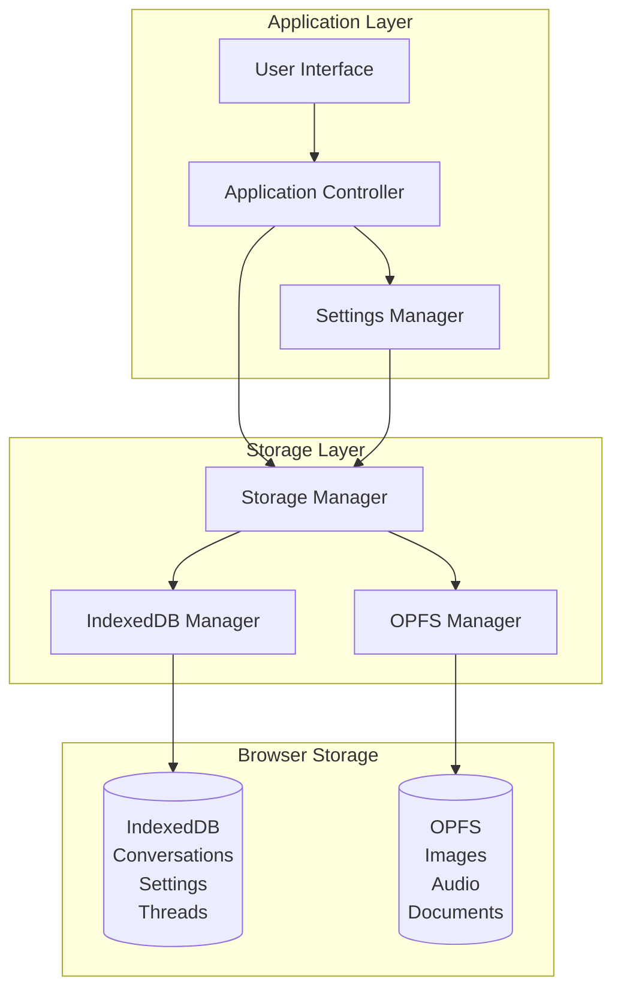

# Design Document: Data Management

## Overview

The Data Management feature provides comprehensive data lifecycle management for the Local AI Assistant, including persistent storage of conversations and settings, data clearing functionality, and data integrity guarantees. The design ensures that all user data is stored reliably in IndexedDB and OPFS, can be completely cleared when requested, and maintains consistency across storage operations.

The architecture implements a dual-storage strategy: IndexedDB for structured data (messages, threads, settings) and OPFS for large binary assets (images, audio). The system provides atomic operations for data persistence and comprehensive cleanup functionality to reset the application state.

## Architecture

### High-Level Architecture



### Component Responsibilities

**Storage Manager**
- Provides unified interface for all storage operations
- Coordinates IndexedDB and OPFS operations
- Implements data clearing functionality
- Ensures data integrity across operations
- Manages storage quota and persistence

**IndexedDB Manager**
- Handles all IndexedDB operations
- Implements message and thread storage
- Manages settings persistence
- Provides transaction management
- Implements cleanup operations

**OPFS Manager**
- Handles all OPFS file operations
- Stores and retrieves binary assets
- Implements file deletion
- Manages directory structure
- Provides cleanup operations

**Settings Manager**
- Manages application settings
- Persists settings changes
- Loads settings on initialization
- Provides default values
- Validates setting values

## Components and Interfaces

### 1. StorageManager (Enhanced)

**Purpose:** Provides unified interface for all storage operations with data clearing functionality.

**Interface:**
```typescript
interface StorageManager {
  // Conversation operations
  saveMessage(threadId: string, message: Message): Promise<void>;
  loadThread(threadId: string): Promise<Message[]>;
  listThreads(): Promise<ThreadMetadata[]>;
  deleteThread(threadId: string): Promise<void>;
  
  // Asset operations
  saveAsset(assetId: string, data: Blob): Promise<void>;
  loadAsset(assetId: string): Promise<Blob>;
  deleteAsset(assetId: string): Promise<void>;
  
  // Settings operations
  saveSetting(key: string, value: any): Promise<void>;
  loadSetting(key: string): Promise<any>;
  loadAllSettings(): Promise<Record<string, any>>;
  
  // Storage management
  requestPersistence(): Promise<boolean>;
  getStorageEstimate(): Promise<StorageEstimate>;
  clearAllData(): Promise<void>;
  
  // Data integrity
  verifyDataIntegrity(): Promise<IntegrityReport>;
}

interface Message {
  id: string;
  threadId: string;
  role: 'user' | 'assistant';
  content: string;
  timestamp: number;
  complete: boolean;  // For streaming messages
  attachments?: Attachment[];
}

interface ThreadMetadata {
  id: string;
  title: string;
  lastMessageTime: number;
  messageCount: number;
}

interface IntegrityReport {
  valid: boolean;
  errors: string[];
  warnings: string[];
}
```

**Key Behaviors:**
- Implements atomic operations for data consistency
- Coordinates cleanup across IndexedDB and OPFS
- Verifies data integrity on critical operations
- Handles storage quota exceeded errors
- Requests persistent storage on initialization

### 2. ClearDataOperation

**Purpose:** Implements comprehensive data clearing functionality.

**Interface:**
```typescript
interface ClearDataOperation {
  // Clear all data and reset application
  clearAll(): Promise<ClearResult>;
  
  // Clear specific data types
  clearConversations(): Promise<void>;
  clearSettings(): Promise<void>;
  clearAssets(): Promise<void>;
  clearModelCache(): Promise<void>;
  
  // Get data size before clearing
  getDataSize(): Promise<DataSize>;
}

interface ClearResult {
  success: boolean;
  clearedStores: string[];
  clearedFiles: number;
  errors: string[];
}

interface DataSize {
  conversations: number;  // Bytes
  settings: number;       // Bytes
  assets: number;         // Bytes
  modelCache: number;     // Bytes
  total: number;          // Bytes
}

class ClearDataOperationImpl implements ClearDataOperation {
  constructor(
    private indexDBManager: IndexedDBManager,
    private opfsManager: OPFSManager
  ) {}
  
  async clearAll(): Promise<ClearResult> {
    const result: ClearResult = {
      success: true,
      clearedStores: [],
      clearedFiles: 0,
      errors: [],
    };
    
    try {
      // Clear IndexedDB stores
      await this.clearConversations();
      result.clearedStores.push('conversations');
      
      await this.clearSettings();
      result.clearedStores.push('settings');
      
      await this.clearModelCache();
      result.clearedStores.push('modelCache');
      
      // Clear OPFS files
      const fileCount = await this.clearAssets();
      result.clearedFiles = fileCount;
      
    } catch (error) {
      result.success = false;
      result.errors.push(error.message);
    }
    
    return result;
  }
  
  async clearConversations(): Promise<void> {
    await this.indexDBManager.clearStore('threads');
    await this.indexDBManager.clearStore('messages');
  }
  
  async clearSettings(): Promise<void> {
    await this.indexDBManager.clearStore('settings');
  }
  
  async clearAssets(): Promise<number> {
    return await this.opfsManager.clearAllFiles();
  }
  
  async clearModelCache(): Promise<void> {
    await this.indexDBManager.clearStore('modelWeights');
  }
  
  async getDataSize(): Promise<DataSize> {
    const estimate = await navigator.storage.estimate();
    
    return {
      conversations: await this.indexDBManager.getStoreSize('messages'),
      settings: await this.indexDBManager.getStoreSize('settings'),
      assets: await this.opfsManager.getTotalSize(),
      modelCache: await this.indexDBManager.getStoreSize('modelWeights'),
      total: estimate.usage || 0,
    };
  }
}
```

**Key Behaviors:**
- Clears all IndexedDB object stores
- Removes all OPFS files and directories
- Provides granular clearing options
- Reports what was cleared and any errors
- Calculates data size before clearing

### 3. IndexedDBManager (Enhanced)

**Purpose:** Manages all IndexedDB operations with cleanup functionality.

**Interface:**
```typescript
interface IndexedDBManager {
  // Store operations
  clearStore(storeName: string): Promise<void>;
  getStoreSize(storeName: string): Promise<number>;
  getAllStores(): Promise<string[]>;
  
  // Message operations
  saveMessage(message: Message): Promise<void>;
  getMessage(messageId: string): Promise<Message | null>;
  getThreadMessages(threadId: string): Promise<Message[]>;
  updateMessageComplete(messageId: string, complete: boolean): Promise<void>;
  
  // Thread operations
  saveThread(thread: Thread): Promise<void>;
  getThread(threadId: string): Promise<Thread | null>;
  getAllThreads(): Promise<Thread[]>;
  deleteThread(threadId: string): Promise<void>;
  
  // Settings operations
  saveSetting(key: string, value: any): Promise<void>;
  getSetting(key: string): Promise<any>;
  getAllSettings(): Promise<Record<string, any>>;
}

class IndexedDBManagerImpl implements IndexedDBManager {
  private db: IDBDatabase | null = null;
  private readonly DB_NAME = 'LocalAIAssistant';
  private readonly DB_VERSION = 1;
  
  async clearStore(storeName: string): Promise<void> {
    const db = await this.getDB();
    const transaction = db.transaction(storeName, 'readwrite');
    const store = transaction.objectStore(storeName);
    await store.clear();
  }
  
  async getStoreSize(storeName: string): Promise<number> {
    const db = await this.getDB();
    const transaction = db.transaction(storeName, 'readonly');
    const store = transaction.objectStore(storeName);
    
    let size = 0;
    const cursor = await store.openCursor();
    
    while (cursor) {
      // Estimate size by serializing value
      const serialized = JSON.stringify(cursor.value);
      size += serialized.length;
      await cursor.continue();
    }
    
    return size;
  }
  
  async updateMessageComplete(messageId: string, complete: boolean): Promise<void> {
    const db = await this.getDB();
    const transaction = db.transaction('messages', 'readwrite');
    const store = transaction.objectStore('messages');
    
    const message = await store.get(messageId);
    if (message) {
      message.complete = complete;
      await store.put(message);
    }
  }
}
```

**Key Behaviors:**
- Implements efficient store clearing
- Calculates store sizes for reporting
- Updates message completion status for streaming
- Provides atomic transaction operations
- Handles database upgrade migrations

### 4. OPFSManager (Enhanced)

**Purpose:** Manages all OPFS operations with cleanup functionality.

**Interface:**
```typescript
interface OPFSManager {
  // File operations
  writeFile(path: string, data: Blob): Promise<void>;
  readFile(path: string): Promise<Blob>;
  deleteFile(path: string): Promise<void>;
  fileExists(path: string): Promise<boolean>;
  
  // Directory operations
  createDirectory(path: string): Promise<void>;
  deleteDirectory(path: string): Promise<void>;
  listFiles(path: string): Promise<string[]>;
  
  // Cleanup operations
  clearAllFiles(): Promise<number>;
  getTotalSize(): Promise<number>;
}

class OPFSManagerImpl implements OPFSManager {
  private root: FileSystemDirectoryHandle | null = null;
  
  async clearAllFiles(): Promise<number> {
    const root = await this.getRoot();
    let fileCount = 0;
    
    // Recursively delete all files and directories
    for await (const entry of root.values()) {
      if (entry.kind === 'file') {
        await root.removeEntry(entry.name);
        fileCount++;
      } else if (entry.kind === 'directory') {
        const count = await this.deleteDirectoryRecursive(entry);
        fileCount += count;
        await root.removeEntry(entry.name, { recursive: true });
      }
    }
    
    return fileCount;
  }
  
  private async deleteDirectoryRecursive(
    dir: FileSystemDirectoryHandle
  ): Promise<number> {
    let count = 0;
    
    for await (const entry of dir.values()) {
      if (entry.kind === 'file') {
        count++;
      } else if (entry.kind === 'directory') {
        count += await this.deleteDirectoryRecursive(entry);
      }
    }
    
    return count;
  }
  
  async getTotalSize(): Promise<number> {
    const root = await this.getRoot();
    return await this.calculateDirectorySize(root);
  }
  
  private async calculateDirectorySize(
    dir: FileSystemDirectoryHandle
  ): Promise<number> {
    let size = 0;
    
    for await (const entry of dir.values()) {
      if (entry.kind === 'file') {
        const file = await entry.getFile();
        size += file.size;
      } else if (entry.kind === 'directory') {
        size += await this.calculateDirectorySize(entry);
      }
    }
    
    return size;
  }
}
```

**Key Behaviors:**
- Recursively deletes all files and directories
- Calculates total storage usage
- Handles nested directory structures
- Provides atomic file operations
- Reports number of files deleted

### 5. SettingsManager

**Purpose:** Manages application settings with persistence.

**Interface:**
```typescript
interface SettingsManager {
  // Get setting value
  get<T>(key: string, defaultValue: T): Promise<T>;
  
  // Set setting value
  set(key: string, value: any): Promise<void>;
  
  // Get all settings
  getAll(): Promise<Settings>;
  
  // Reset to defaults
  resetToDefaults(): Promise<void>;
  
  // Listen for changes
  onChange(callback: (key: string, value: any) => void): void;
}

interface Settings {
  temperature: number;
  topK: number;
  enableImageGeneration: boolean;
  enableSpeech: boolean;
  enableWebSearch: boolean;
  theme: 'light' | 'dark' | 'auto';
  preferredProvider: 'chrome' | 'webllm' | 'api' | 'auto';
}

const DEFAULT_SETTINGS: Settings = {
  temperature: 0.7,
  topK: 40,
  enableImageGeneration: false,
  enableSpeech: false,
  enableWebSearch: false,
  theme: 'auto',
  preferredProvider: 'auto',
};
```

**Key Behaviors:**
- Provides type-safe setting access
- Persists changes immediately to IndexedDB
- Loads settings on initialization
- Emits change events for UI updates
- Validates setting values

## Data Models

### Message Schema (Enhanced)

```typescript
interface Message {
  id: string;                    // UUID v4
  threadId: string;              // Foreign key to Thread
  role: 'user' | 'assistant' | 'system';
  content: string;               // Markdown-formatted text
  timestamp: number;             // Unix timestamp
  complete: boolean;             // True when streaming is done
  attachments: Attachment[];
  metadata: MessageMetadata;
}
```

### Clear Data Result Schema

```typescript
interface ClearResult {
  success: boolean;
  clearedStores: string[];       // Names of cleared IndexedDB stores
  clearedFiles: number;          // Number of OPFS files deleted
  errors: string[];              // Any errors encountered
  timestamp: number;             // When clearing occurred
}
```

## Error Handling

### Error Categories and Recovery Strategies

**1. Storage Quota Exceeded**
- **Cause:** IndexedDB or OPFS quota exceeded
- **Detection:** QuotaExceededError exception
- **Recovery:** Prompt user to clear old data, offer automatic cleanup
- **User Action Required:** Yes

**2. Clear Data Failure**
- **Cause:** Permission denied or storage locked
- **Detection:** Exception during clear operation
- **Recovery:** Retry with exponential backoff, log error
- **User Action Required:** Possibly (close other tabs)

**3. Data Corruption**
- **Cause:** Incomplete write or browser crash
- **Detection:** Integrity check fails
- **Recovery:** Offer to clear corrupted data
- **User Action Required:** Yes

**4. Persistence Request Denied**
- **Cause:** User denies persistent storage permission
- **Detection:** navigator.storage.persist() returns false
- **Recovery:** Display warning about potential data loss
- **User Action Required:** No (continue with non-persistent storage)

## Testing Strategy

### Dual Testing Approach

**Unit Tests** focus on:
- Clear data operation completeness
- Message persistence and retrieval
- Settings persistence and loading
- Stream completion marking
- Storage quota handling
- Data integrity verification

**Property-Based Tests** focus on:
- Storage round-trip consistency
- Clear data completeness
- Stream completion persistence
- Settings persistence

### Property-Based Testing Configuration

**Framework:** fast-check (TypeScript/JavaScript)

**Configuration:**
- Minimum 100 iterations per property test
- Tag format: `// Feature: data-management, Property N: <description>`

**Test Organization:**
```
tests/
├── unit/
│   ├── storage-manager.test.ts
│   ├── clear-data.test.ts
│   ├── settings-manager.test.ts
│   └── indexeddb-manager.test.ts
├── properties/
│   ├── storage-properties.test.ts
│   ├── clear-data-properties.test.ts
│   └── settings-properties.test.ts
└── integration/
    └── data-lifecycle.test.ts
```

### Testing Challenges

**Challenge 1: IndexedDB Asynchronicity**
- IndexedDB operations are asynchronous
- **Solution:** Use async/await consistently in tests
- **Solution:** Clear database in beforeEach hooks

**Challenge 2: OPFS Availability**
- OPFS may not be available in all test environments
- **Solution:** Mock OPFS for unit tests
- **Solution:** Skip OPFS tests when unavailable

**Challenge 3: Storage Quota**
- Can't easily test quota exceeded in unit tests
- **Solution:** Mock storage.estimate() for quota tests
- **Solution:** Use small test data to avoid real quota issues

## Correctness Properties

*A property is a characteristic or behavior that should hold true across all valid executions of a system—essentially, a formal statement about what the system should do. Properties serve as the bridge between human-readable specifications and machine-verifiable correctness guarantees.*

### Property 1: Storage Round-Trip Consistency

*For any* message, thread, or setting, storing it then immediately retrieving it should return data equivalent to the original.

**Validates: Requirements 1.3, 1.4, 2.1, 2.2**

### Property 2: Data Clearing Completeness

*For any* state where data exists in storage, executing the clear data operation should remove all data from both IndexedDB and OPFS, making it non-retrievable.

**Validates: Requirements 1.6**

### Property 3: Stream Completion Persistence

*For any* completed streaming response, the message should be marked as complete in storage and remain marked as complete after retrieval.

**Validates: Requirements 3.6**

### Property 4: Settings Persistence

*For any* valid settings configuration, changing a setting should persist it to storage, and reloading the application should restore that setting.

**Validates: Requirements 1.3, 1.4**

### Property 5: Thread Message Ordering

*For any* thread with multiple messages, retrieving the thread should return all messages in chronological order (sorted by timestamp).

**Validates: Requirements 2.5**

### Property 6: Clear Data Idempotence

*For any* storage state, calling clearAllData() multiple times should produce the same result (all data cleared) without errors.

**Validates: Requirements 1.6**

### Edge Cases

The following edge cases should be handled gracefully:

- **Empty Storage**: Clearing empty storage should succeed without errors
- **Partial Clear Failure**: If one store fails to clear, others should still be cleared
- **Concurrent Writes**: Multiple simultaneous writes should not corrupt data
- **Incomplete Streaming**: Messages with complete=false should be handled correctly
- **Large Messages**: Very large messages should be stored without truncation

### Unit Test Examples

The following specific examples should be covered by unit tests:

- **Clear Data Button**: Verify button exists and triggers clear operation
- **Message Persistence**: Verify messages are stored and retrieved correctly
- **Settings Persistence**: Verify settings are stored and loaded correctly
- **Stream Completion**: Verify complete flag is updated correctly
- **Storage Quota**: Verify quota exceeded error is handled
- **Clear Result**: Verify clear operation returns correct result object
