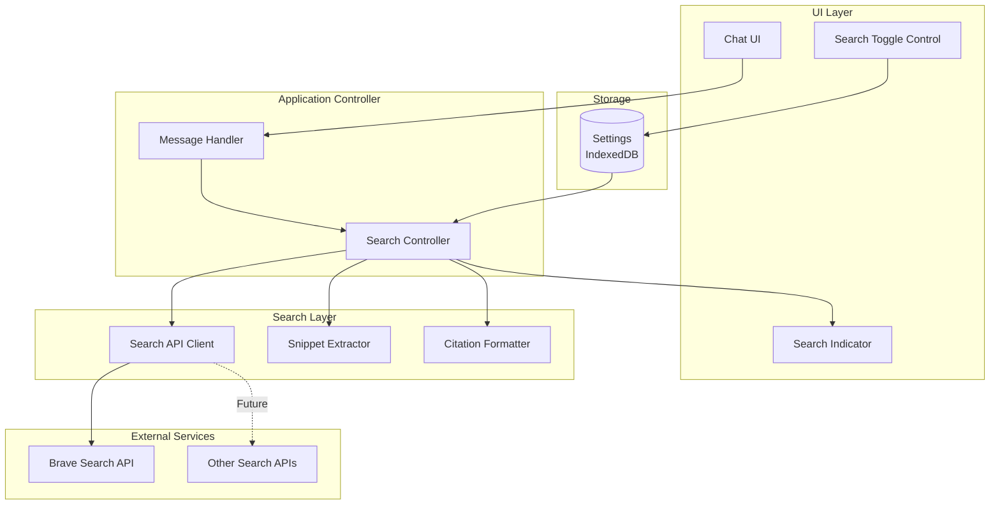

# Design Document: Web Search Integration

## Overview

The Web Search Integration feature extends the Local AI Assistant with the ability to retrieve current information from the web via external search APIs. This design implements a conditional search system that respects user privacy preferences through an explicit toggle control. When enabled, the system queries search APIs, extracts relevant snippets, includes them in the model's context, and cites sources in responses.

The architecture is designed to be API-agnostic, with initial support for Brave Search API, but extensible to other providers (Google Custom Search, Bing, etc.). The feature integrates seamlessly with the existing provider abstraction layer and maintains the assistant's privacy-first principles by making external data access explicit and user-controlled.

## Architecture

### High-Level Architecture



### Component Responsibilities

**Search Controller**
- Determines when to trigger search based on user query
- Coordinates search API calls and result processing
- Manages search state and indicator visibility
- Integrates search results into model context

**Search API Client**
- Abstracts search API interactions
- Handles API authentication and rate limiting
- Supports multiple search providers
- Implements retry logic and error handling

**Snippet Extractor**
- Extracts relevant text snippets from search results
- Ranks results by relevance to query
- Limits snippet length to fit context window
- Removes duplicate or low-quality content

**Citation Formatter**
- Formats source URLs for inclusion in responses
- Generates markdown-formatted citations
- Tracks which sources were used in each response
- Ensures citations are visible and accessible

## Components and Interfaces

### 1. SearchController

**Purpose:** Orchestrates web search operations and integrates results into the conversation flow.

**Interface:**
```typescript
interface SearchController {
  // Check if search is enabled
  isSearchEnabled(): boolean;
  
  // Enable or disable search
  setSearchEnabled(enabled: boolean): Promise<void>;
  
  // Determine if a query should trigger search
  shouldSearch(query: string): boolean;
  
  // Execute search and return formatted context
  search(query: string): Promise<SearchContext>;
  
  // Format citations for a response
  formatCitations(sources: SearchResult[]): string;
}

interface SearchContext {
  snippets: string[];
  sources: SearchResult[];
  contextText: string;  // Formatted for model prompt
}

interface SearchResult {
  title: string;
  url: string;
  snippet: string;
  publishedDate?: string;
  relevanceScore: number;
}
```

**Key Behaviors:**
- Checks search toggle state before executing searches
- Uses heuristics to determine if query needs current information
- Limits search results to top 3-5 most relevant
- Caches search results briefly to avoid duplicate API calls
- Shows/hides search indicator based on operation state

### 2. SearchAPIClient

**Purpose:** Provides a unified interface for different search API providers.

**Interface:**
```typescript
interface SearchAPIClient {
  // Execute a search query
  search(query: string, options?: SearchOptions): Promise<SearchResponse>;
  
  // Check if API is configured and available
  isAvailable(): Promise<boolean>;
  
  // Get API usage statistics
  getUsageStats(): APIUsageStats;
}

interface SearchOptions {
  maxResults?: number;      // Default: 5
  language?: string;        // Default: 'en'
  safeSearch?: boolean;     // Default: true
  freshness?: 'day' | 'week' | 'month' | 'year';
}

interface SearchResponse {
  results: SearchResult[];
  totalResults: number;
  searchTime: number;       // Milliseconds
}

interface APIUsageStats {
  requestsToday: number;
  quotaLimit: number;
  quotaRemaining: number;
}
```

**Key Behaviors:**
- Stores API key securely in IndexedDB
- Implements exponential backoff for rate limiting
- Validates API responses and handles errors gracefully
- Supports multiple providers through adapter pattern
- Tracks API usage to prevent quota exhaustion

### 3. BraveSearchClient (Implementation)

**Purpose:** Concrete implementation of SearchAPIClient for Brave Search API.

**Interface:**
```typescript
class BraveSearchClient implements SearchAPIClient {
  private apiKey: string;
  private baseURL = 'https://api.search.brave.com/res/v1/web/search';
  
  constructor(apiKey: string) {
    this.apiKey = apiKey;
  }
  
  async search(query: string, options?: SearchOptions): Promise<SearchResponse> {
    // Build request with query parameters
    // Execute fetch with API key header
    // Parse and transform response
  }
  
  async isAvailable(): Promise<boolean> {
    // Verify API key is set
    // Optionally ping API to check connectivity
  }
  
  getUsageStats(): APIUsageStats {
    // Return cached usage stats from last response
  }
}
```

**API Details:**
- Endpoint: `GET https://api.search.brave.com/res/v1/web/search`
- Authentication: `X-Subscription-Token` header
- Rate Limit: Varies by plan (typically 1 req/sec for free tier)
- Response Format: JSON with web results, news, videos, etc.

### 4. SnippetExtractor

**Purpose:** Processes search results to extract relevant text snippets for context injection.

**Interface:**
```typescript
interface SnippetExtractor {
  // Extract and rank snippets from search results
  extractSnippets(results: SearchResult[], query: string): ExtractedSnippet[];
  
  // Calculate relevance score for a snippet
  calculateRelevance(snippet: string, query: string): number;
  
  // Truncate snippet to fit context window
  truncateSnippet(snippet: string, maxLength: number): string;
}

interface ExtractedSnippet {
  text: string;
  source: SearchResult;
  relevanceScore: number;
  truncated: boolean;
}
```

**Key Behaviors:**
- Ranks snippets by keyword overlap with query
- Removes HTML tags and formatting from snippets
- Truncates long snippets while preserving sentence boundaries
- Deduplicates similar snippets from different sources
- Limits total snippet length to ~500 tokens

### 5. CitationFormatter

**Purpose:** Formats source citations for inclusion in model responses.

**Interface:**
```typescript
interface CitationFormatter {
  // Format citations as markdown list
  formatCitations(sources: SearchResult[]): string;
  
  // Generate inline citation markers
  generateInlineCitation(index: number): string;
  
  // Extract domain from URL for display
  extractDomain(url: string): string;
}
```

**Key Behaviors:**
- Generates numbered citations: `[1]`, `[2]`, etc.
- Formats as markdown list at end of response
- Includes title, domain, and URL for each source
- Handles long URLs gracefully (truncate with ellipsis)
- Ensures citations are clickable links

**Example Output:**
```markdown
Sources:
[1] [How to Use WebGPU](https://developer.mozilla.org/en-US/docs/Web/API/WebGPU_API) - developer.mozilla.org
[2] [WebGPU Fundamentals](https://webgpufundamentals.org/) - webgpufundamentals.org
```

## Data Models

### Search Settings Schema

```typescript
interface SearchSettings {
  enabled: boolean;
  provider: 'brave' | 'google' | 'bing';
  apiKey: string;
  maxResults: number;
  freshness: 'day' | 'week' | 'month' | 'year' | null;
  safeSearch: boolean;
}
```

### Search Cache Schema

```typescript
interface SearchCacheEntry {
  query: string;
  results: SearchResult[];
  timestamp: number;
  expiresAt: number;  // Unix timestamp
}
```

**Cache Strategy:**
- Cache search results for 5 minutes to avoid duplicate API calls
- Store in memory (not IndexedDB) to avoid persistence overhead
- Invalidate cache when search settings change
- Maximum 10 cached queries (LRU eviction)

## Error Handling

### Error Categories and Recovery Strategies

**1. API Key Missing**
- **Cause:** User hasn't configured search API key
- **Detection:** API key not found in settings
- **Recovery:** Display setup instructions in UI, disable search toggle
- **User Action Required:** Yes

**2. API Rate Limit Exceeded**
- **Cause:** Too many requests in short time period
- **Detection:** HTTP 429 response from API
- **Recovery:** Fallback to model's built-in knowledge, display warning
- **User Action Required:** No (automatic retry after cooldown)

**3. Network Timeout**
- **Cause:** Search API unreachable or slow
- **Detection:** Fetch timeout (5 second limit)
- **Recovery:** Fallback to model's built-in knowledge, log error
- **User Action Required:** No

**4. Invalid API Response**
- **Cause:** API returns malformed JSON or unexpected structure
- **Detection:** JSON parse error or missing expected fields
- **Recovery:** Log error, fallback to model's built-in knowledge
- **User Action Required:** No

**5. Quota Exhausted**
- **Cause:** API quota limit reached for billing period
- **Detection:** HTTP 403 or specific error code from API
- **Recovery:** Disable search automatically, notify user
- **User Action Required:** Yes (upgrade plan or wait for quota reset)

### Error Display Strategy

All search errors should be handled gracefully without interrupting the conversation:

```typescript
interface SearchError {
  type: 'api_key_missing' | 'rate_limit' | 'network' | 'invalid_response' | 'quota_exhausted';
  message: string;
  userMessage: string;  // Friendly message for UI
  recoverable: boolean;
}
```

**User-Facing Messages:**
- API Key Missing: "Web search requires an API key. Configure it in settings."
- Rate Limit: "Search temporarily unavailable. Using model's built-in knowledge."
- Network: "Couldn't reach search service. Using model's built-in knowledge."
- Quota Exhausted: "Search quota exceeded. Web search disabled until quota resets."

## Testing Strategy

### Dual Testing Approach

**Unit Tests** focus on:
- API client request formatting and response parsing
- Snippet extraction and relevance scoring
- Citation formatting and markdown generation
- Error handling for each error category
- Settings persistence and retrieval

**Property-Based Tests** focus on:
- Search toggle state consistency
- Citation completeness for all search results
- Snippet length constraints
- Context injection format validity

### Property-Based Testing Configuration

**Framework:** fast-check (TypeScript/JavaScript)

**Configuration:**
- Minimum 100 iterations per property test
- Tag format: `// Feature: web-search-integration, Property N: <description>`

**Test Organization:**
```
tests/
├── unit/
│   ├── search-api-client.test.ts
│   ├── snippet-extractor.test.ts
│   └── citation-formatter.test.ts
├── properties/
│   ├── search-toggle-properties.test.ts
│   ├── citation-properties.test.ts
│   └── context-injection-properties.test.ts
└── integration/
    └── search-flow.test.ts
```

### Testing Challenges

**Challenge 1: External API Dependency**
- Real API calls are slow and consume quota
- **Solution:** Mock SearchAPIClient for unit tests
- **Solution:** Use test API key with low quota for integration tests

**Challenge 2: Non-Deterministic Search Results**
- Search results change over time
- **Solution:** Test structural properties (e.g., "results have required fields")
- **Solution:** Use cached responses for deterministic tests

**Challenge 3: Rate Limiting**
- Tests may trigger rate limits
- **Solution:** Implement exponential backoff in test suite
- **Solution:** Use mock client for property tests

## Correctness Properties

*A property is a characteristic or behavior that should hold true across all valid executions of a system—essentially, a formal statement about what the system should do. Properties serve as the bridge between human-readable specifications and machine-verifiable correctness guarantees.*

### Property 1: Conditional Search API Calls

*For any* query when web search is enabled, the system should call the search API; when web search is disabled, no search API calls should be made.

**Validates: Requirements 1.1, 1.5**

### Property 2: Context Injection Completeness

*For any* search results retrieved, all relevant snippets should be included in the prompt context sent to the model.

**Validates: Requirements 1.2**

### Property 3: Source Citation Presence

*For any* response generated using search results, the response should include citations to all source URLs that were used.

**Validates: Requirements 1.3**

### Property 4: Search Toggle Persistence

*For any* search toggle state change, the new state should be persisted to storage and restored on application reload.

**Validates: Requirements 1.4**

### Property 5: Search Indicator Visibility

*For any* active search operation when web search is enabled, a visual indicator should be displayed in the UI; when search completes or is disabled, the indicator should be hidden.

**Validates: Requirements 1.6**

### Property 6: Snippet Length Constraint

*For any* extracted snippet, the snippet length should not exceed the configured maximum length, and truncation should preserve sentence boundaries when possible.

**Validates: Design requirement for context window management**

### Property 7: Citation Format Validity

*For any* set of search results, the formatted citations should be valid markdown with clickable links and numbered references.

**Validates: Requirements 1.3**

### Edge Cases

The following edge cases should be handled gracefully:

- **Empty Search Results**: When API returns zero results, fallback to model's knowledge
- **Malformed URLs**: Invalid URLs in search results should be filtered out
- **Very Long Snippets**: Snippets exceeding max length should be truncated at sentence boundaries
- **Duplicate Results**: Identical snippets from different sources should be deduplicated
- **Special Characters**: URLs and snippets with special characters should be properly escaped

### Unit Test Examples

The following specific examples should be covered by unit tests:

- **API Key Validation**: Verify that missing API key prevents search execution
- **Toggle State**: Verify that search toggle correctly enables/disables search
- **Citation Formatting**: Verify that citations are formatted as numbered markdown links
- **Snippet Extraction**: Verify that snippets are extracted and ranked by relevance
- **Error Handling**: Verify that each error type displays appropriate user message
- **Indicator Display**: Verify that search indicator appears during search and disappears after
