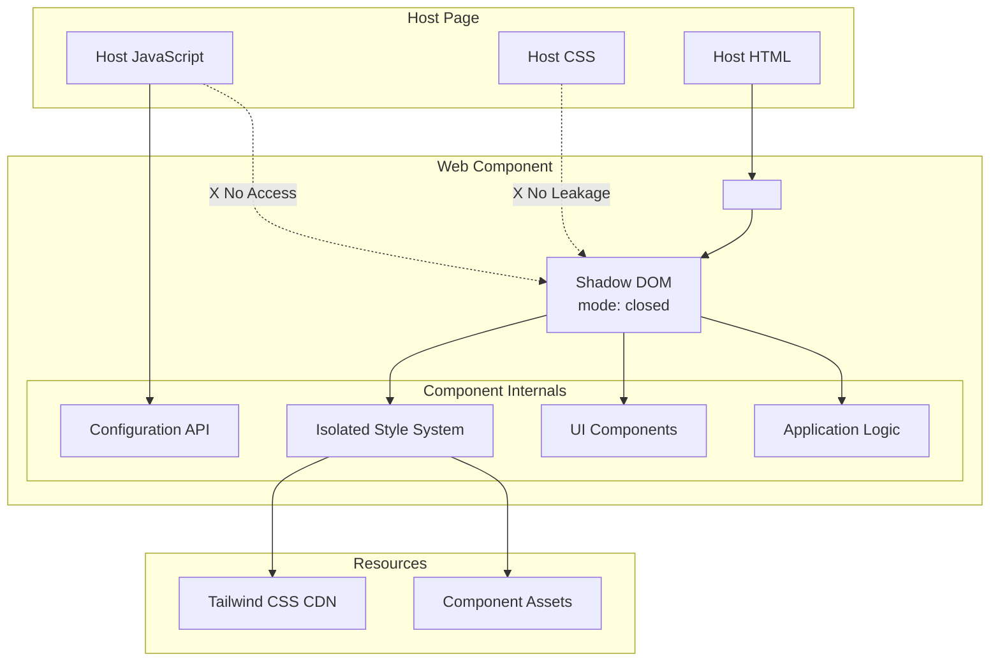

# Design Document: Embeddability and Configuration

## Overview

The Embeddability and Configuration feature enables the Local AI Assistant to be embedded on any website as a self-contained Web Component with complete style isolation. The design uses Shadow DOM with closed mode to prevent CSS conflicts and script access, while providing a clean configuration API for host pages to customize appearance and behavior. All resources are loaded with appropriate CORS headers to ensure cross-origin compatibility.

The architecture prioritizes developer experience by providing a simple embedding API, sensible defaults, and comprehensive configuration options. The component can function both as a standalone PWA and as an embeddable widget, with the same codebase supporting both use cases.

## Architecture

### High-Level Architecture



### Component Responsibilities

**Configuration API**
- Accepts configuration from host pages
- Validates configuration objects
- Applies theme and feature customization
- Provides default values for missing options

**Shadow DOM Boundary**
- Encapsulates all component internals
- Prevents style leakage in both directions
- Blocks script access to internal DOM
- Maintains component isolation

**Style System**
- Loads Tailwind CSS from CDN into Shadow DOM
- Applies custom theme variables
- Ensures all styles are scoped to component
- Handles dynamic theme changes

**Resource Loader**
- Loads all resources with CORS headers
- Handles CDN fallbacks
- Manages asset caching
- Ensures cross-origin compatibility

## Components and Interfaces

### 1. Web Component Registration

**Purpose:** Registers the custom element and initializes the Shadow DOM.

**Implementation:**
```typescript
class LocalAIAssistant extends HTMLElement {
  private shadow: ShadowRoot;
  private config: AssistantConfig;
  
  constructor() {
    super();
    // Create closed Shadow DOM
    this.shadow = this.attachShadow({ mode: 'closed' });
    
    // Initialize with default config
    this.config = this.getDefaultConfig();
  }
  
  connectedCallback() {
    // Load styles and render UI
    this.loadStyles();
    this.render();
    
    // Apply configuration from attributes
    this.applyAttributeConfig();
  }
  
  disconnectedCallback() {
    // Cleanup resources
    this.cleanup();
  }
  
  // Configuration API
  configure(config: Partial<AssistantConfig>): void {
    this.config = { ...this.config, ...config };
    this.applyConfig();
  }
  
  // Get current configuration
  getConfig(): AssistantConfig {
    return { ...this.config };
  }
}

// Register the custom element
customElements.define('local-ai-assistant', LocalAIAssistant);
```

**Key Behaviors:**
- Uses closed Shadow DOM to prevent external access
- Accepts configuration via JavaScript API and HTML attributes
- Provides lifecycle hooks for initialization and cleanup
- Exposes minimal public API surface

### 2. Configuration API

**Purpose:** Provides a type-safe API for host pages to customize the assistant.

**Interface:**
```typescript
interface AssistantConfig {
  // Theme customization
  theme: ThemeConfig;
  
  // Feature toggles
  features: FeatureConfig;
  
  // Provider preferences
  provider: ProviderConfig;
  
  // UI customization
  ui: UIConfig;
}

interface ThemeConfig {
  mode: 'light' | 'dark' | 'auto';
  primaryColor: string;      // Hex color
  backgroundColor: string;   // Hex color
  textColor: string;         // Hex color
  fontFamily: string;        // CSS font-family value
}

interface FeatureConfig {
  textChat: boolean;
  imageGeneration: boolean;
  speechInput: boolean;
  speechOutput: boolean;
  documentUpload: boolean;
  imageUpload: boolean;
  webSearch: boolean;
}

interface ProviderConfig {
  preferred: 'chrome' | 'webllm' | 'api' | 'auto';
  apiKey?: string;           // For API provider
  apiEndpoint?: string;      // For custom endpoints
}

interface UIConfig {
  position: 'bottom-right' | 'bottom-left' | 'top-right' | 'top-left' | 'center';
  width: string;             // CSS width value
  height: string;            // CSS height value
  showHeader: boolean;
  showThreadList: boolean;
  initialMessage?: string;   // Welcome message
}
```

**Default Configuration:**
```typescript
const DEFAULT_CONFIG: AssistantConfig = {
  theme: {
    mode: 'auto',
    primaryColor: '#3b82f6',
    backgroundColor: '#ffffff',
    textColor: '#1f2937',
    fontFamily: 'system-ui, -apple-system, sans-serif',
  },
  features: {
    textChat: true,
    imageGeneration: false,
    speechInput: false,
    speechOutput: false,
    documentUpload: false,
    imageUpload: false,
    webSearch: false,
  },
  provider: {
    preferred: 'auto',
  },
  ui: {
    position: 'bottom-right',
    width: '400px',
    height: '600px',
    showHeader: true,
    showThreadList: true,
  },
};
```

**Key Behaviors:**
- Validates all configuration values
- Provides sensible defaults for all options
- Supports partial configuration (deep merge)
- Emits events when configuration changes
- Persists user preferences to IndexedDB

### 3. Style Isolation System

**Purpose:** Ensures complete style isolation between host page and component.

**Implementation:**
```typescript
class StyleIsolationManager {
  private shadow: ShadowRoot;
  private styleElement: HTMLStyleElement;
  
  constructor(shadow: ShadowRoot) {
    this.shadow = shadow;
    this.styleElement = document.createElement('style');
  }
  
  async loadStyles(): Promise<void> {
    // Load Tailwind CSS from CDN
    await this.loadTailwindCSS();
    
    // Add custom animations
    this.addCustomStyles();
    
    // Apply theme variables
    this.applyThemeVariables();
  }
  
  private async loadTailwindCSS(): Promise<void> {
    const link = document.createElement('link');
    link.rel = 'stylesheet';
    link.href = 'https://cdn.jsdelivr.net/npm/@tailwindcss/browser@4';
    link.crossOrigin = 'anonymous';
    
    return new Promise((resolve, reject) => {
      link.onload = () => resolve();
      link.onerror = () => reject(new Error('Failed to load Tailwind CSS'));
      this.shadow.appendChild(link);
    });
  }
  
  private addCustomStyles(): void {
    this.styleElement.textContent = `
      @keyframes fadeIn {
        from { opacity: 0; transform: translateY(10px); }
        to { opacity: 1; transform: translateY(0); }
      }
      
      @keyframes blink {
        0%, 100% { opacity: 1; }
        50% { opacity: 0.3; }
      }
      
      .animate-fadeIn {
        animation: fadeIn 0.3s ease-out;
      }
      
      .animate-blink {
        animation: blink 1s ease-in-out infinite;
      }
    `;
    this.shadow.appendChild(this.styleElement);
  }
  
  applyThemeVariables(theme: ThemeConfig): void {
    const root = this.shadow.host as HTMLElement;
    root.style.setProperty('--primary-color', theme.primaryColor);
    root.style.setProperty('--bg-color', theme.backgroundColor);
    root.style.setProperty('--text-color', theme.textColor);
    root.style.setProperty('--font-family', theme.fontFamily);
  }
}
```

**Key Behaviors:**
- Loads Tailwind CSS into Shadow DOM (not host page)
- Defines custom animations within Shadow DOM
- Uses CSS custom properties for theme variables
- Prevents any style leakage to/from host page
- Handles CDN failures gracefully

### 4. Resource Loader

**Purpose:** Loads all component resources with appropriate CORS headers.

**Interface:**
```typescript
interface ResourceLoader {
  // Load a resource with CORS headers
  loadResource(url: string, type: ResourceType): Promise<Response>;
  
  // Load multiple resources in parallel
  loadResources(urls: string[]): Promise<Response[]>;
  
  // Check if a resource is cached
  isCached(url: string): boolean;
}

type ResourceType = 'script' | 'style' | 'image' | 'font' | 'data';

class CORSResourceLoader implements ResourceLoader {
  private cache: Map<string, Response>;
  
  constructor() {
    this.cache = new Map();
  }
  
  async loadResource(url: string, type: ResourceType): Promise<Response> {
    // Check cache first
    if (this.cache.has(url)) {
      return this.cache.get(url)!.clone();
    }
    
    // Fetch with CORS headers
    const response = await fetch(url, {
      mode: 'cors',
      credentials: 'omit',
      headers: {
        'Accept': this.getAcceptHeader(type),
      },
    });
    
    if (!response.ok) {
      throw new Error(`Failed to load resource: ${url}`);
    }
    
    // Cache successful response
    this.cache.set(url, response.clone());
    
    return response;
  }
  
  private getAcceptHeader(type: ResourceType): string {
    switch (type) {
      case 'script': return 'application/javascript';
      case 'style': return 'text/css';
      case 'image': return 'image/*';
      case 'font': return 'font/*';
      case 'data': return 'application/json';
      default: return '*/*';
    }
  }
}
```

**Key Behaviors:**
- Sets `mode: 'cors'` for all fetch requests
- Includes appropriate Accept headers
- Caches successful responses
- Handles network errors gracefully
- Supports CDN fallbacks

### 5. Attribute Configuration Parser

**Purpose:** Parses configuration from HTML attributes for declarative setup.

**Implementation:**
```typescript
class AttributeConfigParser {
  parseAttributes(element: HTMLElement): Partial<AssistantConfig> {
    const config: Partial<AssistantConfig> = {};
    
    // Parse theme attributes
    if (element.hasAttribute('theme')) {
      config.theme = {
        mode: element.getAttribute('theme') as 'light' | 'dark' | 'auto',
      };
    }
    
    if (element.hasAttribute('primary-color')) {
      config.theme = {
        ...config.theme,
        primaryColor: element.getAttribute('primary-color')!,
      };
    }
    
    // Parse feature toggles
    const features: Partial<FeatureConfig> = {};
    if (element.hasAttribute('enable-image-gen')) {
      features.imageGeneration = element.getAttribute('enable-image-gen') === 'true';
    }
    if (element.hasAttribute('enable-speech')) {
      features.speechInput = element.getAttribute('enable-speech') === 'true';
      features.speechOutput = element.getAttribute('enable-speech') === 'true';
    }
    if (element.hasAttribute('enable-web-search')) {
      features.webSearch = element.getAttribute('enable-web-search') === 'true';
    }
    
    if (Object.keys(features).length > 0) {
      config.features = features;
    }
    
    // Parse UI attributes
    if (element.hasAttribute('position')) {
      config.ui = {
        position: element.getAttribute('position') as UIConfig['position'],
      };
    }
    
    return config;
  }
}
```

**Example Usage:**
```html
<!-- Declarative configuration via attributes -->
<local-ai-assistant
  theme="dark"
  primary-color="#10b981"
  enable-web-search="true"
  position="bottom-right"
></local-ai-assistant>

<!-- Programmatic configuration via JavaScript -->
<script>
  const assistant = document.querySelector('local-ai-assistant');
  assistant.configure({
    theme: {
      mode: 'dark',
      primaryColor: '#10b981',
    },
    features: {
      webSearch: true,
    },
    ui: {
      position: 'bottom-right',
    },
  });
</script>
```

## Data Models

### Configuration Storage Schema

```typescript
interface StoredConfig {
  version: number;           // Config schema version
  config: AssistantConfig;
  lastModified: number;      // Unix timestamp
}
```

**Storage Strategy:**
- Store user preferences in IndexedDB
- Merge with host-provided configuration
- Host configuration takes precedence over stored preferences
- Clear stored config when component is removed

## Error Handling

### Error Categories and Recovery Strategies

**1. Invalid Configuration**
- **Cause:** Host provides malformed configuration object
- **Detection:** Type validation fails
- **Recovery:** Use default values for invalid fields, log warning
- **User Action Required:** No

**2. CDN Load Failure**
- **Cause:** Tailwind CSS CDN unreachable
- **Detection:** Link element onerror event
- **Recovery:** Fallback to inline styles, display warning
- **User Action Required:** No

**3. CORS Violation**
- **Cause:** Resource loaded without proper CORS headers
- **Detection:** Fetch throws CORS error
- **Recovery:** Log error, attempt fallback URL
- **User Action Required:** No

**4. Shadow DOM Not Supported**
- **Cause:** Browser doesn't support Shadow DOM
- **Detection:** attachShadow() throws error
- **Recovery:** Display compatibility error message
- **User Action Required:** Yes (upgrade browser)

### Error Display Strategy

Configuration errors should be logged to console but not interrupt functionality:

```typescript
interface ConfigError {
  field: string;
  value: any;
  reason: string;
  severity: 'warning' | 'error';
}
```

**User-Facing Messages:**
- Invalid Config: Console warning only, use defaults
- CDN Failure: "Some styles may not load correctly"
- CORS Violation: Console error only
- Shadow DOM Unsupported: "Your browser doesn't support this component. Please upgrade."

## Testing Strategy

### Dual Testing Approach

**Unit Tests** focus on:
- Configuration parsing and validation
- Attribute parsing
- Style isolation verification
- Resource loading with CORS headers
- Error handling for each error category

**Property-Based Tests** focus on:
- Configuration merge correctness
- Style isolation guarantees
- Resource loading consistency

### Property-Based Testing Configuration

**Framework:** fast-check (TypeScript/JavaScript)

**Configuration:**
- Minimum 100 iterations per property test
- Tag format: `// Feature: embeddability-configuration, Property N: <description>`

**Test Organization:**
```
tests/
├── unit/
│   ├── web-component.test.ts
│   ├── config-api.test.ts
│   ├── style-isolation.test.ts
│   └── resource-loader.test.ts
├── properties/
│   ├── config-properties.test.ts
│   ├── style-isolation-properties.test.ts
│   └── resource-loading-properties.test.ts
└── integration/
    └── embedding.test.ts
```

### Testing Challenges

**Challenge 1: Shadow DOM Testing**
- Shadow DOM internals are not accessible from outside
- **Solution:** Expose test hooks in development mode
- **Solution:** Test public API behavior rather than internals

**Challenge 2: Style Isolation Verification**
- Need to verify styles don't leak in either direction
- **Solution:** Create test host pages with conflicting styles
- **Solution:** Use computed styles to verify isolation

**Challenge 3: CORS Testing**
- CORS behavior depends on server configuration
- **Solution:** Mock fetch for unit tests
- **Solution:** Use test server with CORS headers for integration tests

## Correctness Properties

*A property is a characteristic or behavior that should hold true across all valid executions of a system—essentially, a formal statement about what the system should do. Properties serve as the bridge between human-readable specifications and machine-verifiable correctness guarantees.*

### Property 1: Style Isolation

*For any* CSS styles applied to the host page, those styles should not affect the appearance of elements within the assistant's Shadow DOM.

**Validates: Requirements 1.3**

### Property 2: Shadow DOM Inaccessibility

*For any* attempt to access the component's shadowRoot from host page scripts, the access should be blocked (return null or undefined).

**Validates: Requirements 1.4**

### Property 3: Configuration API Validity

*For any* valid configuration object provided by the host page, the assistant should accept and apply the configuration without errors.

**Validates: Requirements 1.5**

### Property 4: Configuration Merge Correctness

*For any* partial configuration object, merging it with the default configuration should produce a complete, valid configuration with all required fields.

**Validates: Requirements 1.5**

### Property 5: Resource Loading Headers

*For any* resource fetch request made by the assistant, the request should include appropriate CORS headers (mode: 'cors').

**Validates: Requirements 1.6**

### Property 6: Theme Application Consistency

*For any* theme configuration, applying the theme should update all relevant CSS custom properties in the Shadow DOM.

**Validates: Requirements 1.5**

### Property 7: Attribute Configuration Parsing

*For any* valid HTML attribute configuration, parsing the attributes should produce a configuration object equivalent to the programmatic API.

**Validates: Requirements 1.5**

### Edge Cases

The following edge cases should be handled gracefully:

- **Missing Configuration**: Component works with all defaults
- **Partial Configuration**: Missing fields use defaults
- **Invalid Color Values**: Fallback to default colors
- **Conflicting Attributes**: Programmatic API takes precedence
- **CDN Unavailable**: Fallback to minimal inline styles

### Unit Test Examples

The following specific examples should be covered by unit tests:

- **Component Registration**: Verify custom element is registered correctly
- **Shadow DOM Mode**: Verify Shadow DOM is created with mode: 'closed'
- **Default Configuration**: Verify default config has all required fields
- **Configuration Validation**: Verify invalid configs are rejected or corrected
- **Style Loading**: Verify Tailwind CSS loads into Shadow DOM
- **CORS Headers**: Verify fetch requests include mode: 'cors'
- **Attribute Parsing**: Verify attributes are correctly parsed into config
