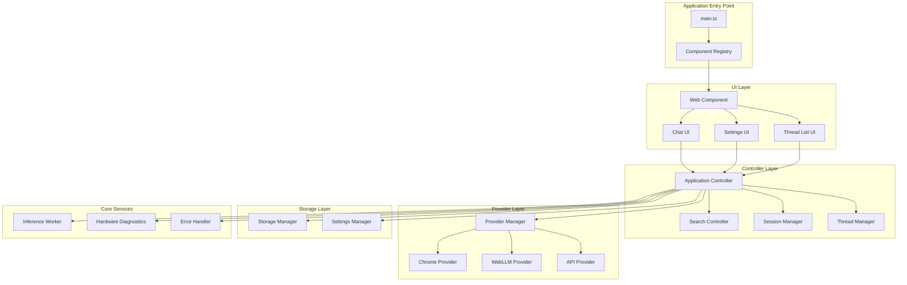

# Design Document: Final Integration

## Overview

The Final Integration phase brings together all components of the Local AI Assistant into a cohesive, production-ready system. This design focuses on three key areas: component wiring and event flow, bundle optimization for fast loading, and comprehensive integration testing to ensure system reliability.

The architecture ensures that all components communicate correctly, the application loads quickly even on slower connections, and the complete system is thoroughly tested across all supported browsers and use cases.

## Architecture

### High-Level Integration Architecture



### Integration Responsibilities

**Application Controller**
- Orchestrates all component interactions
- Manages application lifecycle
- Coordinates event flow between layers
- Handles global error recovery
- Manages loading states and transitions

**Component Registry**
- Registers all custom elements
- Initializes component dependencies
- Manages component lifecycle
- Provides dependency injection

**Event Flow Manager**
- Routes events between components
- Implements event bus for loose coupling
- Handles event prioritization
- Manages event cancellation

**Bundle Optimizer**
- Implements code splitting
- Configures tree-shaking
- Manages lazy loading
- Optimizes asset delivery

## Components and Interfaces

### 1. Application Controller (Integration)

**Purpose:** Orchestrates all component interactions and manages application lifecycle.

**Interface:**
```typescript
interface ApplicationController {
  // Lifecycle management
  initialize(): Promise<void>;
  shutdown(): Promise<void>;
  
  // Component coordination
  wireComponents(): void;
  
  // Event handling
  handleUserMessage(message: string): Promise<void>;
  handleProviderChange(provider: string): Promise<void>;
  handleSettingChange(key: string, value: any): Promise<void>;
  handleThreadSwitch(threadId: string): Promise<void>;
  
  // State management
  getApplicationState(): ApplicationState;
  setLoadingState(loading: boolean, message?: string): void;
}

interface ApplicationState {
  initialized: boolean;
  activeProvider: string | null;
  activeThread: string | null;
  loading: boolean;
  loadingMessage: string | null;
  error: Error | null;
}

class ApplicationControllerImpl implements ApplicationController {
  constructor(
    private providerManager: ProviderManager,
    private storageManager: StorageManager,
    private settingsManager: SettingsManager,
    private searchController: SearchController,
    private sessionManager: SessionManager,
    private threadManager: ThreadManager,
    private hardwareDiagnostics: HardwareDiagnostics,
    private errorHandler: ErrorHandler
  ) {}
  
  async initialize(): Promise<void> {
    try {
      // Request persistent storage
      await this.storageManager.requestPersistence();
      
      // Load settings
      await this.settingsManager.loadAllSettings();
      
      // Detect hardware capabilities
      await this.hardwareDiagnostics.detectCapabilities();
      
      // Detect and select provider
      await this.providerManager.autoSelectProvider();
      
      // Load active thread
      await this.threadManager.loadActiveThread();
      
      // Wire all components
      this.wireComponents();
      
    } catch (error) {
      this.errorHandler.handleFatalError(error);
    }
  }
  
  wireComponents(): void {
    // Wire UI to controllers
    this.wireChatUI();
    this.wireSettingsUI();
    this.wireThreadListUI();
    
    // Wire controller events
    this.wireProviderEvents();
    this.wireStorageEvents();
    this.wireSearchEvents();
  }
  
  private wireChatUI(): void {
    // Connect chat UI events to handlers
    // Handle message send, stream cancel, etc.
  }
  
  private wireSettingsUI(): void {
    // Connect settings UI events to handlers
    // Handle setting changes, provider switches, etc.
  }
  
  private wireThreadListUI(): void {
    // Connect thread list UI events to handlers
    // Handle thread selection, creation, deletion, etc.
  }
}
```

**Key Behaviors:**
- Initializes all components in correct order
- Wires event handlers between components
- Manages global loading states
- Handles fatal errors gracefully
- Coordinates shutdown and cleanup

### 2. Event Flow Manager

**Purpose:** Manages event routing and coordination between components.

**Interface:**
```typescript
interface EventFlowManager {
  // Register event handlers
  on(event: string, handler: EventHandler): void;
  off(event: string, handler: EventHandler): void;
  
  // Emit events
  emit(event: string, data?: any): void;
  
  // Event prioritization
  setPriority(event: string, priority: number): void;
  
  // Event cancellation
  cancel(event: string): void;
}

type EventHandler = (data: any) => void | Promise<void>;

class EventFlowManagerImpl implements EventFlowManager {
  private handlers: Map<string, Set<EventHandler>>;
  private priorities: Map<string, number>;
  private cancelled: Set<string>;
  
  constructor() {
    this.handlers = new Map();
    this.priorities = new Map();
    this.cancelled = new Set();
  }
  
  on(event: string, handler: EventHandler): void {
    if (!this.handlers.has(event)) {
      this.handlers.set(event, new Set());
    }
    this.handlers.get(event)!.add(handler);
  }
  
  off(event: string, handler: EventHandler): void {
    this.handlers.get(event)?.delete(handler);
  }
  
  async emit(event: string, data?: any): Promise<void> {
    if (this.cancelled.has(event)) {
      this.cancelled.delete(event);
      return;
    }
    
    const handlers = this.handlers.get(event);
    if (!handlers) return;
    
    // Sort by priority
    const sortedHandlers = Array.from(handlers).sort((a, b) => {
      const priorityA = this.priorities.get(event) || 0;
      const priorityB = this.priorities.get(event) || 0;
      return priorityB - priorityA;
    });
    
    // Execute handlers
    for (const handler of sortedHandlers) {
      await handler(data);
    }
  }
  
  cancel(event: string): void {
    this.cancelled.add(event);
  }
}
```

**Key Behaviors:**
- Implements publish-subscribe pattern
- Supports event prioritization
- Allows event cancellation
- Handles async event handlers
- Prevents memory leaks through cleanup

### 3. Bundle Optimizer Configuration

**Purpose:** Configures build tools for optimal bundle size and loading performance.

**Vite Configuration:**
```typescript
// vite.config.ts
import { defineConfig } from 'vite';

export default defineConfig({
  build: {
    // Enable tree-shaking
    minify: 'terser',
    terserOptions: {
      compress: {
        drop_console: true,  // Remove console.log in production
        drop_debugger: true,
      },
    },
    
    // Code splitting
    rollupOptions: {
      output: {
        manualChunks: {
          // Vendor chunk for external dependencies
          vendor: ['dexie'],
          
          // Provider chunks (lazy loaded)
          'chrome-provider': ['./src/providers/chrome-provider.ts'],
          'webllm-provider': ['./src/providers/webllm-provider.ts'],
          'api-provider': ['./src/providers/api-provider.ts'],
          
          // Feature chunks (lazy loaded)
          'search': ['./src/search/search-controller.ts'],
          'multimodal': ['./src/multimodal/inference-worker-manager.ts'],
        },
      },
    },
    
    // Chunk size warnings
    chunkSizeWarningLimit: 500,  // KB
  },
  
  // Asset optimization
  assetsInlineLimit: 4096,  // Inline assets < 4KB
  
  // CSS optimization
  css: {
    devSourcemap: false,
  },
});
```

**Lazy Loading Strategy:**
```typescript
// Lazy load providers
async function loadProvider(type: 'chrome' | 'webllm' | 'api') {
  switch (type) {
    case 'chrome':
      return await import('./providers/chrome-provider');
    case 'webllm':
      return await import('./providers/webllm-provider');
    case 'api':
      return await import('./providers/api-provider');
  }
}

// Lazy load features
async function loadSearchFeature() {
  return await import('./search/search-controller');
}

async function loadMultimodalFeature() {
  return await import('./multimodal/inference-worker-manager');
}
```

**Key Behaviors:**
- Splits code into logical chunks
- Lazy loads providers and features
- Removes debug code in production
- Inlines small assets
- Optimizes CSS delivery

### 4. Integration Test Suite

**Purpose:** Provides comprehensive integration tests for the complete system.

**Test Structure:**
```typescript
// tests/integration/complete-workflow.test.ts

describe('Complete Workflow Integration', () => {
  let assistant: LocalAIAssistant;
  
  beforeEach(async () => {
    // Initialize assistant
    assistant = new LocalAIAssistant();
    await assistant.initialize();
  });
  
  afterEach(async () => {
    // Cleanup
    await assistant.shutdown();
    await clearAllData();
  });
  
  test('End-to-end text chat workflow', async () => {
    // 1. Send message
    await assistant.sendMessage('Hello, world!');
    
    // 2. Verify message stored
    const messages = await assistant.getMessages();
    expect(messages).toHaveLength(2);  // User + assistant
    
    // 3. Verify response rendered
    const lastMessage = messages[messages.length - 1];
    expect(lastMessage.role).toBe('assistant');
    expect(lastMessage.content).toBeTruthy();
  });
  
  test('Provider switching workflow', async () => {
    // 1. Get initial provider
    const initialProvider = assistant.getActiveProvider();
    
    // 2. Switch provider
    await assistant.setProvider('webllm');
    
    // 3. Verify provider changed
    const newProvider = assistant.getActiveProvider();
    expect(newProvider).toBe('webllm');
    
    // 4. Send message with new provider
    await assistant.sendMessage('Test message');
    
    // 5. Verify response
    const messages = await assistant.getMessages();
    expect(messages.length).toBeGreaterThan(0);
  });
  
  test('Settings persistence workflow', async () => {
    // 1. Change setting
    await assistant.setSetting('temperature', 0.9);
    
    // 2. Reload assistant
    await assistant.shutdown();
    assistant = new LocalAIAssistant();
    await assistant.initialize();
    
    // 3. Verify setting persisted
    const temperature = await assistant.getSetting('temperature');
    expect(temperature).toBe(0.9);
  });
  
  test('Thread management workflow', async () => {
    // 1. Create new thread
    const threadId = await assistant.createThread();
    
    // 2. Send messages
    await assistant.sendMessage('Message 1');
    await assistant.sendMessage('Message 2');
    
    // 3. Switch to new thread
    const newThreadId = await assistant.createThread();
    await assistant.switchThread(newThreadId);
    
    // 4. Verify thread switched
    const messages = await assistant.getMessages();
    expect(messages).toHaveLength(0);
    
    // 5. Switch back
    await assistant.switchThread(threadId);
    const oldMessages = await assistant.getMessages();
    expect(oldMessages.length).toBeGreaterThan(0);
  });
  
  test('Error recovery workflow', async () => {
    // 1. Trigger error (invalid provider)
    await expect(
      assistant.setProvider('invalid')
    ).rejects.toThrow();
    
    // 2. Verify assistant still functional
    await assistant.sendMessage('Test after error');
    
    // 3. Verify response
    const messages = await assistant.getMessages();
    expect(messages.length).toBeGreaterThan(0);
  });
  
  test('Clear data workflow', async () => {
    // 1. Create data
    await assistant.sendMessage('Test message');
    await assistant.setSetting('temperature', 0.9);
    
    // 2. Clear all data
    await assistant.clearAllData();
    
    // 3. Verify data cleared
    const messages = await assistant.getMessages();
    expect(messages).toHaveLength(0);
    
    const temperature = await assistant.getSetting('temperature');
    expect(temperature).toBe(0.7);  // Default value
  });
});
```

**Cross-Component Tests:**
```typescript
// tests/integration/cross-component.test.ts

describe('Cross-Component Integration', () => {
  test('UI to Storage flow', async () => {
    // Test that UI interactions correctly persist to storage
  });
  
  test('Provider to UI flow', async () => {
    // Test that provider responses correctly render in UI
  });
  
  test('Settings to Provider flow', async () => {
    // Test that settings changes correctly update provider config
  });
  
  test('Search to Provider flow', async () => {
    // Test that search results correctly inject into provider context
  });
});
```

**Key Behaviors:**
- Tests complete user workflows
- Verifies cross-component interactions
- Tests error recovery scenarios
- Ensures data persistence
- Validates state management

## Data Models

### Application State Schema

```typescript
interface ApplicationState {
  initialized: boolean;
  activeProvider: string | null;
  activeThread: string | null;
  loading: boolean;
  loadingMessage: string | null;
  error: Error | null;
  hardwareProfile: HardwareProfile | null;
}
```

### Bundle Metrics Schema

```typescript
interface BundleMetrics {
  totalSize: number;           // Bytes
  gzippedSize: number;         // Bytes
  chunks: ChunkMetric[];
  loadTime: number;            // Milliseconds
}

interface ChunkMetric {
  name: string;
  size: number;                // Bytes
  gzippedSize: number;         // Bytes
  lazy: boolean;
}
```

## Error Handling

### Error Categories and Recovery Strategies

**1. Initialization Failure**
- **Cause:** Critical component fails to initialize
- **Detection:** Exception during initialize()
- **Recovery:** Display error message, offer to reset application
- **User Action Required:** Yes

**2. Component Wiring Failure**
- **Cause:** Event handler registration fails
- **Detection:** Exception during wireComponents()
- **Recovery:** Log error, continue with partial wiring
- **User Action Required:** No

**3. Bundle Load Failure**
- **Cause:** Lazy-loaded chunk fails to load
- **Detection:** Dynamic import() throws error
- **Recovery:** Retry with exponential backoff, fallback to basic functionality
- **User Action Required:** No

**4. Integration Test Failure**
- **Cause:** Component interaction doesn't work as expected
- **Detection:** Test assertion fails
- **Recovery:** N/A (development time)
- **User Action Required:** Yes (fix code)

## Testing Strategy

### Integration Testing Approach

**Test Categories:**
1. **End-to-End Workflows**: Complete user journeys from start to finish
2. **Cross-Component Tests**: Interactions between specific components
3. **Error Recovery Tests**: System behavior under error conditions
4. **Performance Tests**: Loading time and bundle size validation
5. **Browser Compatibility Tests**: Functionality across different browsers

**Test Configuration:**
```typescript
// vitest.config.ts
export default defineConfig({
  test: {
    environment: 'jsdom',
    setupFiles: ['./tests/setup.ts'],
    coverage: {
      provider: 'v8',
      reporter: ['text', 'html'],
      exclude: [
        'node_modules/',
        'tests/',
        '**/*.test.ts',
      ],
    },
    testTimeout: 30000,  // 30 seconds for integration tests
  },
});
```

**Test Organization:**
```
tests/
├── integration/
│   ├── complete-workflow.test.ts
│   ├── cross-component.test.ts
│   ├── error-recovery.test.ts
│   ├── performance.test.ts
│   └── browser-compatibility.test.ts
└── e2e/
    ├── chrome-workflow.test.ts
    ├── firefox-workflow.test.ts
    └── edge-workflow.test.ts
```

### Testing Challenges

**Challenge 1: Async Component Initialization**
- Components initialize asynchronously
- **Solution:** Use async/await consistently, wait for initialization
- **Solution:** Provide initialization complete event

**Challenge 2: Browser-Specific Features**
- Some features only work in specific browsers
- **Solution:** Use conditional test execution
- **Solution:** Mock browser-specific APIs for unit tests

**Challenge 3: Large Bundle Testing**
- Testing bundle size requires actual build
- **Solution:** Run bundle analysis in CI pipeline
- **Solution:** Set size budgets and fail build if exceeded

## Correctness Properties

*A property is a characteristic or behavior that should hold true across all valid executions of a system—essentially, a formal statement about what the system should do. Properties serve as the bridge between human-readable specifications and machine-verifiable correctness guarantees.*

### Property 1: Initialization Completeness

*For any* successful initialization, all required components should be initialized and wired correctly.

**Validates: Requirements 1.1, 1.2**

### Property 2: Event Flow Consistency

*For any* user interaction, events should flow through the correct components in the correct order.

**Validates: Requirements 1.2**

### Property 3: Loading State Visibility

*For any* long-running operation, a loading state should be displayed to the user.

**Validates: Requirements 1.3**

### Property 4: Bundle Size Constraint

*For any* production build, the initial bundle size (gzipped) should be under 500KB.

**Validates: Requirements 2.5**

### Property 5: Lazy Loading Correctness

*For any* lazy-loaded feature, the feature should load successfully when requested and function correctly.

**Validates: Requirements 2.2**

### Property 6: Integration Test Coverage

*For any* major feature, there should be at least one integration test that verifies the complete workflow.

**Validates: Requirements 3.1**

### Edge Cases

The following edge cases should be handled gracefully:

- **Initialization Failure**: Display error message, offer reset
- **Component Wiring Failure**: Continue with partial functionality
- **Bundle Load Failure**: Retry, fallback to basic features
- **Concurrent Operations**: Queue operations, prevent race conditions
- **Memory Exhaustion**: Cleanup unused resources, display warning

### Unit Test Examples

The following specific examples should be covered by unit tests:

- **Component Registration**: Verify all components are registered
- **Event Wiring**: Verify event handlers are connected
- **Loading States**: Verify loading indicators appear/disappear
- **Bundle Size**: Verify bundle size is within limits
- **Lazy Loading**: Verify features load on demand
- **Error Recovery**: Verify system recovers from errors
