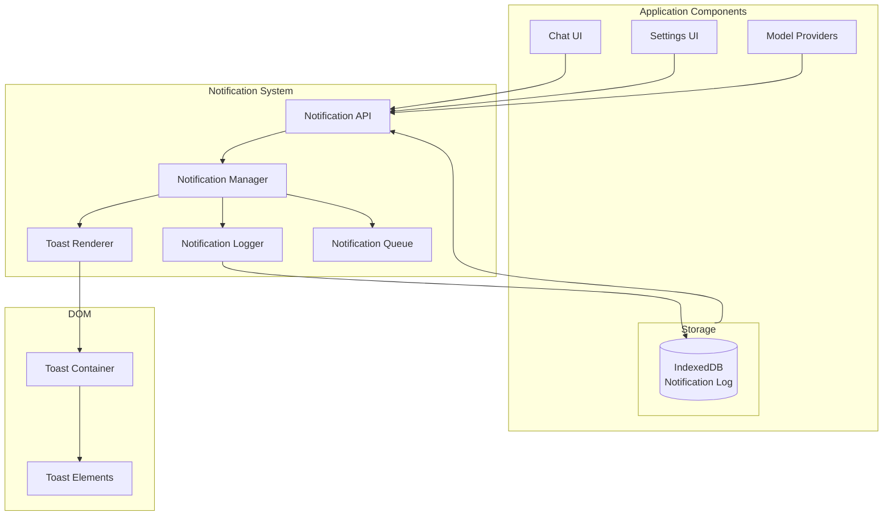

# Design Document: UI Notification System

## Overview

The UI Notification System provides a centralized, toast-style notification mechanism for the Local AI Assistant. It displays errors, warnings, and informational messages as non-intrusive popups that appear from the bottom-right corner, stack vertically, and auto-expire after 5 seconds. The system includes persistent logging to IndexedDB and integrates with storage quota management to proactively inform users about storage needs.

The architecture follows a singleton pattern with a global API, allowing any component to trigger notifications without tight coupling. The notification container lives within the Shadow DOM for style isolation.

## Architecture

### High-Level Architecture



### Component Responsibilities

**Notification API**
- Provides global `notify()` function
- Validates notification parameters
- Deduplicates identical notifications
- Routes to Notification Manager

**Notification Manager**
- Manages active notification lifecycle
- Handles queueing when limit exceeded
- Coordinates rendering and logging
- Manages timers for auto-dismiss

**Toast Renderer**
- Creates and styles toast DOM elements
- Handles entry/exit animations
- Manages stacking and positioning
- Renders markdown content

**Notification Logger**
- Persists notifications to IndexedDB
- Enforces 100-notification limit
- Provides filtering and retrieval
- Handles log clearing

**Notification Queue**
- Holds notifications when limit exceeded
- Releases queued items on dismiss
- Maintains FIFO order

## Components and Interfaces

### 1. NotificationAPI

**Purpose:** Global entry point for triggering notifications.

**Interface:**
```typescript
type NotificationType = 'error' | 'warning' | 'info';

interface NotificationOptions {
  type: NotificationType;
  title: string;
  message: string;
  duration?: number;           // Default: 5000ms
  action?: NotificationAction;
  storageInfo?: StorageInfo;   // For storage-related notifications
}

interface NotificationAction {
  label: string;
  callback: () => void;
}

interface StorageInfo {
  required: number;            // Bytes needed
  current: number;             // Current usage
  quota: number;               // Total quota
  breakdown?: StorageBreakdown;
}

interface StorageBreakdown {
  models: number;
  conversations: number;
  cache: number;
}

// Global API
function notify(options: NotificationOptions): string;  // Returns notification ID
function dismissNotification(id: string): void;
function clearAllNotifications(): void;
```

**Key Behaviors:**
- Validates required parameters (type, title, message)
- Generates unique notification ID
- Checks for duplicates within 5-second window
- Routes to NotificationManager

### 2. NotificationManager

**Purpose:** Orchestrates notification lifecycle and state.

**Interface:**
```typescript
interface NotificationManager {
  show(options: NotificationOptions): string;
  dismiss(id: string): void;
  dismissAll(): void;
  getActive(): Notification[];
  getQueued(): Notification[];
}

interface Notification {
  id: string;
  type: NotificationType;
  title: string;
  message: string;
  timestamp: number;
  duration: number;
  action?: NotificationAction;
  storageInfo?: StorageInfo;
}

class NotificationManagerImpl implements NotificationManager {
  private active: Map<string, Notification> = new Map();
  private queued: Notification[] = [];
  private timers: Map<string, number> = new Map();
  private readonly MAX_ACTIVE = 5;
  
  show(options: NotificationOptions): string {
    const notification = this.createNotification(options);
    
    // Check for duplicate
    if (this.isDuplicate(notification)) {
      return notification.id;
    }
    
    // Log to persistent storage
    this.logger.log(notification);
    
    if (this.active.size >= this.MAX_ACTIVE) {
      this.queued.push(notification);
      return notification.id;
    }
    
    this.activate(notification);
    return notification.id;
  }
  
  private activate(notification: Notification): void {
    this.active.set(notification.id, notification);
    this.renderer.render(notification, this.active.size - 1);
    this.startTimer(notification);
  }
  
  private startTimer(notification: Notification): void {
    const timer = window.setTimeout(() => {
      this.dismiss(notification.id);
    }, notification.duration);
    this.timers.set(notification.id, timer);
  }
  
  dismiss(id: string): void {
    const notification = this.active.get(id);
    if (!notification) return;
    
    // Clear timer
    const timer = this.timers.get(id);
    if (timer) clearTimeout(timer);
    this.timers.delete(id);
    
    // Remove from active
    this.active.delete(id);
    
    // Animate out
    this.renderer.animateOut(id, () => {
      this.renderer.remove(id);
      this.restack();
      this.processQueue();
    });
  }
  
  private processQueue(): void {
    if (this.queued.length > 0 && this.active.size < this.MAX_ACTIVE) {
      const next = this.queued.shift()!;
      this.activate(next);
    }
  }
  
  private restack(): void {
    let index = 0;
    for (const [id] of this.active) {
      this.renderer.updatePosition(id, index);
      index++;
    }
  }
}
```

**Key Behaviors:**
- Limits active notifications to 5
- Queues excess notifications
- Manages auto-dismiss timers
- Restacks on dismiss
- Deduplicates within 5-second window

### 3. ToastRenderer

**Purpose:** Handles DOM rendering and animations.

**Interface:**
```typescript
interface ToastRenderer {
  render(notification: Notification, index: number): void;
  animateOut(id: string, onComplete: () => void): void;
  remove(id: string): void;
  updatePosition(id: string, index: number): void;
  pauseTimer(id: string): void;
  resumeTimer(id: string): void;
}

class ToastRendererImpl implements ToastRenderer {
  private container: HTMLElement;
  private readonly TOAST_HEIGHT = 100;  // Approximate height + gap
  private readonly ANIMATION_DURATION = 300;
  
  constructor(shadowRoot: ShadowRoot) {
    this.container = this.createContainer(shadowRoot);
  }
  
  private createContainer(shadowRoot: ShadowRoot): HTMLElement {
    const container = document.createElement('div');
    container.className = `
      fixed bottom-4 right-4 z-50
      flex flex-col-reverse gap-2
      pointer-events-none
    `;
    shadowRoot.appendChild(container);
    return container;
  }
  
  render(notification: Notification, index: number): void {
    const toast = this.createToast(notification);
    toast.style.transform = `translateY(${-index * this.TOAST_HEIGHT}px)`;
    
    // Entry animation
    toast.style.animation = 'slideInRight 0.3s ease-out';
    
    this.container.appendChild(toast);
  }
  
  private createToast(notification: Notification): HTMLElement {
    const toast = document.createElement('div');
    toast.id = `toast-${notification.id}`;
    toast.className = this.getToastClasses(notification.type);
    
    toast.innerHTML = `
      <div class="flex items-start gap-3">
        ${this.getIcon(notification.type)}
        <div class="flex-1 min-w-0">
          <h4 class="font-semibold text-sm">${notification.title}</h4>
          <p class="text-sm opacity-90 mt-1">${this.renderMarkdown(notification.message)}</p>
          ${this.renderStorageInfo(notification.storageInfo)}
          ${this.renderAction(notification.action)}
        </div>
        <button class="toast-close opacity-60 hover:opacity-100 transition-opacity">
          <svg class="w-4 h-4" fill="currentColor" viewBox="0 0 20 20">
            <path fill-rule="evenodd" d="M4.293 4.293a1 1 0 011.414 0L10 8.586l4.293-4.293a1 1 0 111.414 1.414L11.414 10l4.293 4.293a1 1 0 01-1.414 1.414L10 11.414l-4.293 4.293a1 1 0 01-1.414-1.414L8.586 10 4.293 5.707a1 1 0 010-1.414z" clip-rule="evenodd"/>
          </svg>
        </button>
      </div>
    `;
    
    // Event listeners
    toast.addEventListener('mouseenter', () => this.pauseTimer(notification.id));
    toast.addEventListener('mouseleave', () => this.resumeTimer(notification.id));
    toast.querySelector('.toast-close')?.addEventListener('click', () => {
      this.manager.dismiss(notification.id);
    });
    
    return toast;
  }
  
  private getToastClasses(type: NotificationType): string {
    const base = `
      pointer-events-auto
      w-80 p-4 rounded-lg shadow-lg
      transition-transform duration-300
    `;
    
    const typeClasses = {
      error: 'bg-red-600 text-white',
      warning: 'bg-yellow-500 text-gray-900',
      info: 'bg-blue-600 text-white',
    };
    
    return `${base} ${typeClasses[type]}`;
  }
  
  private getIcon(type: NotificationType): string {
    const icons = {
      error: `<svg class="w-5 h-5 flex-shrink-0" fill="currentColor" viewBox="0 0 20 20">
        <path fill-rule="evenodd" d="M10 18a8 8 0 100-16 8 8 0 000 16zM8.707 7.293a1 1 0 00-1.414 1.414L8.586 10l-1.293 1.293a1 1 0 101.414 1.414L10 11.414l1.293 1.293a1 1 0 001.414-1.414L11.414 10l1.293-1.293a1 1 0 00-1.414-1.414L10 8.586 8.707 7.293z" clip-rule="evenodd"/>
      </svg>`,
      warning: `<svg class="w-5 h-5 flex-shrink-0" fill="currentColor" viewBox="0 0 20 20">
        <path fill-rule="evenodd" d="M8.257 3.099c.765-1.36 2.722-1.36 3.486 0l5.58 9.92c.75 1.334-.213 2.98-1.742 2.98H4.42c-1.53 0-2.493-1.646-1.743-2.98l5.58-9.92zM11 13a1 1 0 11-2 0 1 1 0 012 0zm-1-8a1 1 0 00-1 1v3a1 1 0 002 0V6a1 1 0 00-1-1z" clip-rule="evenodd"/>
      </svg>`,
      info: `<svg class="w-5 h-5 flex-shrink-0" fill="currentColor" viewBox="0 0 20 20">
        <path fill-rule="evenodd" d="M18 10a8 8 0 11-16 0 8 8 0 0116 0zm-7-4a1 1 0 11-2 0 1 1 0 012 0zM9 9a1 1 0 000 2v3a1 1 0 001 1h1a1 1 0 100-2v-3a1 1 0 00-1-1H9z" clip-rule="evenodd"/>
      </svg>`,
    };
    return icons[type];
  }
  
  private renderStorageInfo(info?: StorageInfo): string {
    if (!info) return '';
    
    const formatGB = (bytes: number) => (bytes / 1024 / 1024 / 1024).toFixed(2);
    
    return `
      <div class="mt-2 text-xs opacity-80">
        <div>Required: ${formatGB(info.required)} GB</div>
        <div>Current: ${formatGB(info.current)} GB / ${formatGB(info.quota)} GB</div>
        ${info.breakdown ? `
          <div class="mt-1">
            <div>• Models: ${formatGB(info.breakdown.models)} GB</div>
            <div>• Conversations: ${formatGB(info.breakdown.conversations)} GB</div>
            <div>• Cache: ${formatGB(info.breakdown.cache)} GB</div>
          </div>
        ` : ''}
      </div>
    `;
  }
  
  animateOut(id: string, onComplete: () => void): void {
    const toast = this.container.querySelector(`#toast-${id}`);
    if (!toast) return;
    
    toast.style.animation = 'slideOutRight 0.3s ease-in forwards';
    setTimeout(onComplete, this.ANIMATION_DURATION);
  }
}
```

**Key Behaviors:**
- Creates styled toast elements with Tailwind classes
- Handles slide-in/slide-out animations
- Renders type-specific icons and colors
- Formats storage information in GB
- Supports markdown in messages

### 4. NotificationLogger

**Purpose:** Persists notifications to IndexedDB for later review.

**Interface:**
```typescript
interface NotificationLogger {
  log(notification: Notification): Promise<void>;
  getAll(): Promise<LoggedNotification[]>;
  getByType(type: NotificationType): Promise<LoggedNotification[]>;
  clear(): Promise<void>;
}

interface LoggedNotification extends Notification {
  loggedAt: number;
}

class NotificationLoggerImpl implements NotificationLogger {
  private readonly STORE_NAME = 'notificationLog';
  private readonly MAX_ENTRIES = 100;
  
  async log(notification: Notification): Promise<void> {
    const logged: LoggedNotification = {
      ...notification,
      loggedAt: Date.now(),
    };
    
    const db = await this.getDB();
    const tx = db.transaction(this.STORE_NAME, 'readwrite');
    const store = tx.objectStore(this.STORE_NAME);
    
    await store.add(logged);
    
    // Enforce limit
    await this.enforceLimit(store);
  }
  
  private async enforceLimit(store: IDBObjectStore): Promise<void> {
    const count = await store.count();
    if (count > this.MAX_ENTRIES) {
      const cursor = await store.openCursor();
      const toDelete = count - this.MAX_ENTRIES;
      let deleted = 0;
      
      while (cursor && deleted < toDelete) {
        await cursor.delete();
        deleted++;
        await cursor.continue();
      }
    }
  }
  
  async getByType(type: NotificationType): Promise<LoggedNotification[]> {
    const all = await this.getAll();
    return all.filter(n => n.type === type);
  }
}
```

**Key Behaviors:**
- Stores notifications with timestamp
- Enforces 100-entry limit (FIFO)
- Supports filtering by type
- Provides clear functionality

### 5. StorageQuotaManager

**Purpose:** Monitors storage usage and requests additional quota.

**Interface:**
```typescript
interface StorageQuotaManager {
  checkQuota(): Promise<StorageStatus>;
  requestMoreStorage(reason: string): Promise<boolean>;
  getStorageBreakdown(): Promise<StorageBreakdown>;
}

interface StorageStatus {
  usage: number;
  quota: number;
  percentUsed: number;
  isLow: boolean;        // > 80%
  isExceeded: boolean;   // > 100%
}

class StorageQuotaManagerImpl implements StorageQuotaManager {
  private readonly WARNING_THRESHOLD = 0.8;  // 80%
  
  async checkQuota(): Promise<StorageStatus> {
    const estimate = await navigator.storage.estimate();
    const usage = estimate.usage || 0;
    const quota = estimate.quota || 0;
    const percentUsed = quota > 0 ? usage / quota : 0;
    
    const status: StorageStatus = {
      usage,
      quota,
      percentUsed,
      isLow: percentUsed >= this.WARNING_THRESHOLD,
      isExceeded: percentUsed >= 1,
    };
    
    if (status.isLow && !status.isExceeded) {
      this.showWarning(status);
    } else if (status.isExceeded) {
      await this.handleExceeded(status);
    }
    
    return status;
  }
  
  private showWarning(status: StorageStatus): void {
    notify({
      type: 'warning',
      title: 'Storage Running Low',
      message: 'Your storage is getting full. Consider clearing old conversations.',
      storageInfo: {
        required: 0,
        current: status.usage,
        quota: status.quota,
      },
      action: {
        label: 'Manage Storage',
        callback: () => this.openStorageSettings(),
      },
    });
  }
  
  private async handleExceeded(status: StorageStatus): Promise<void> {
    const breakdown = await this.getStorageBreakdown();
    
    notify({
      type: 'error',
      title: 'Storage Quota Exceeded',
      message: 'Requesting additional storage from your browser...',
      storageInfo: {
        required: this.calculateRequired(),
        current: status.usage,
        quota: status.quota,
        breakdown,
      },
    });
    
    const granted = await this.requestMoreStorage('Model download and conversation storage');
    
    if (granted) {
      notify({
        type: 'info',
        title: 'Storage Granted',
        message: 'Your browser has granted additional storage. You can continue using the assistant.',
      });
    } else {
      notify({
        type: 'error',
        title: 'Storage Request Denied',
        message: 'Your browser denied the storage request. Try clearing old data or using a different browser.',
        action: {
          label: 'Clear Data',
          callback: () => this.openClearDataDialog(),
        },
      });
    }
  }
  
  async requestMoreStorage(reason: string): Promise<boolean> {
    if (!navigator.storage?.persist) {
      // Fallback for browsers without persist API
      notify({
        type: 'warning',
        title: 'Storage Persistence Unavailable',
        message: `This browser doesn't support persistent storage. Your data may be cleared by the browser. Reason: ${reason}`,
      });
      return false;
    }
    
    return await navigator.storage.persist();
  }
  
  private calculateRequired(): number {
    // 22GB for Gemini Nano + buffer
    return 22 * 1024 * 1024 * 1024;
  }
}
```

**Key Behaviors:**
- Monitors storage at 80% threshold
- Requests persistent storage when exceeded
- Shows detailed breakdown of storage usage
- Provides fallback for unsupported browsers
- Offers actionable alternatives on denial

## Data Models

### Notification Schema

```typescript
interface Notification {
  id: string;                    // UUID v4
  type: NotificationType;        // 'error' | 'warning' | 'info'
  title: string;                 // Short title
  message: string;               // Markdown-formatted body
  timestamp: number;             // Unix timestamp when created
  duration: number;              // Auto-dismiss duration in ms
  action?: NotificationAction;   // Optional action button
  storageInfo?: StorageInfo;     // Optional storage details
}
```

### Logged Notification Schema

```typescript
interface LoggedNotification extends Notification {
  loggedAt: number;              // Unix timestamp when logged
}
```

### IndexedDB Schema

```typescript
// Database: LocalAIAssistant
// Store: notificationLog
{
  keyPath: 'id',
  indexes: [
    { name: 'type', keyPath: 'type' },
    { name: 'loggedAt', keyPath: 'loggedAt' },
  ]
}
```

## Error Handling

### Error Categories

**1. Notification Rendering Failure**
- **Cause:** DOM manipulation error
- **Recovery:** Log to console, skip notification
- **User Impact:** Notification not shown

**2. Logger Storage Failure**
- **Cause:** IndexedDB unavailable or full
- **Recovery:** Continue without logging
- **User Impact:** Notification shown but not logged

**3. Storage Quota Check Failure**
- **Cause:** storage.estimate() unavailable
- **Recovery:** Assume unlimited storage
- **User Impact:** No quota warnings

**4. Persist Request Failure**
- **Cause:** Browser denies or API unavailable
- **Recovery:** Show error notification with alternatives
- **User Impact:** May lose data on browser cleanup

## Correctness Properties

*A property is a characteristic or behavior that should hold true across all valid executions of a system—essentially, a formal statement about what the system should do. Properties serve as the bridge between human-readable specifications and machine-verifiable correctness guarantees.*

### Property 1: Notification Type Styling Consistency

*For any* notification type (error, warning, info), the rendered toast should have the correct background color class and icon matching that type.

**Validates: Requirements 1.5, 1.6**

### Property 2: Notification Stacking Order

*For any* sequence of N notifications (where N ≤ 5), all notifications should be visible and stacked vertically with the most recent at the bottom.

**Validates: Requirements 1.2**

### Property 3: Notification Content Rendering

*For any* notification with title and message, both should appear in the rendered toast. If storageInfo is provided, storage amounts should be formatted in GB.

**Validates: Requirements 3.1, 3.3, 3.4**

### Property 4: Notification Log Round-Trip

*For any* notification that is displayed, it should be retrievable from the notification log with all original properties preserved.

**Validates: Requirements 4.1, 4.4**

### Property 5: Notification Log Filtering

*For any* notification type filter applied to the log, all returned notifications should be of that type and no notifications of other types should be included.

**Validates: Requirements 4.5**

### Property 6: Notification Log Size Limit

*For any* number of notifications logged, the log should never contain more than 100 entries, with oldest entries removed first.

**Validates: Requirements 4.7**

### Property 7: Notification Deduplication

*For any* two identical notifications (same type, title, message) triggered within 5 seconds, only one toast should be displayed.

**Validates: Requirements 7.4**

### Property 8: Notification Queue Processing

*For any* state where notifications are queued, dismissing an active notification should cause exactly one queued notification to become active (if queue is non-empty).

**Validates: Requirements 7.5, 7.6**

### Property 9: API Parameter Acceptance

*For any* valid NotificationOptions object with required fields (type, title, message), the notify() function should return a non-empty notification ID.

**Validates: Requirements 7.2**

## Testing Strategy

### Dual Testing Approach

**Unit Tests** focus on:
- Toast rendering with correct classes
- Animation class application
- Timer start/pause/resume
- Close button functionality
- Storage info formatting
- Log entry creation and retrieval

**Property-Based Tests** focus on:
- Type-styling consistency
- Stacking behavior
- Content rendering
- Log round-trip
- Log filtering
- Log size limit
- Deduplication
- Queue processing

### Property-Based Testing Configuration

**Framework:** fast-check (TypeScript/JavaScript)

**Configuration:**
- Minimum 100 iterations per property test
- Tag format: `// Feature: ui-notification-system, Property N: <description>`

### Test Organization

```
tests/
├── unit/
│   └── ui/
│       ├── notification-manager.test.ts
│       ├── toast-renderer.test.ts
│       └── notification-logger.test.ts
├── properties/
│   └── notification-properties.test.ts
└── integration/
    └── notification-flow.test.ts
```

### Edge Cases

- **Empty message**: Should still render with title only
- **Very long message**: Should truncate or wrap appropriately
- **Rapid notifications**: Should queue correctly
- **All dismissed at once**: Should clear queue properly
- **Browser without IndexedDB**: Should still show notifications
- **Browser without storage.persist**: Should show fallback message
