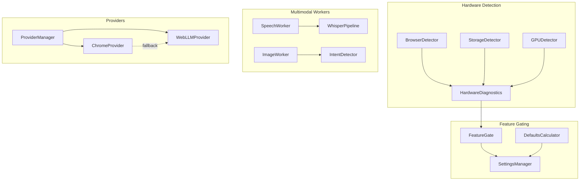

# Design Document: Critical Fixes

## Overview

This design addresses critical issues affecting the Local AI Assistant's cross-browser compatibility, multimodal feature functionality, and user experience. The fixes target hardware detection inconsistencies between browsers, incomplete Whisper ASR integration, non-functional image generation, Gemini Nano availability issues, and insufficient logging for debugging multimodal decisions.

The implementation prioritizes fixes in order of user impact: hardware detection (affects all users), default settings (affects first-time experience), Whisper integration (voice input broken), image generation (feature non-functional), Gemini Nano (Chrome-specific), and logging (developer experience).

## Architecture



## Components and Interfaces

### 1. Enhanced HardwareDiagnostics

**Purpose:** Provide accurate hardware detection across all browsers with graceful degradation.

**Interface:**
```typescript
interface HardwareProfile {
    ram: number | null;           // null if unknown (was defaulting to 4)
    ramDetectionMethod: 'deviceMemory' | 'performance' | 'unknown';
    cpuCores: number;
    storageAvailable: number;     // 0 means unknown, not "no storage"
    storageDetectionMethod: 'estimate' | 'fallback' | 'unknown';
    gpuVRAM: number;
    webGPUSupported: boolean;
    gpuPerformanceScore: number;
    browserName: string;
    timestamp: number;
}

interface DiagnosticLog {
    check: string;
    result: string | number | boolean;
    method: string;
    browser: string;
    timestamp: number;
}
```

**Key Changes:**
- RAM detection returns `null` instead of defaulting to 4GB when `navigator.deviceMemory` unavailable
- Storage detection handles Brave/Firefox restricted quotas gracefully
- All detection methods are logged with browser context
- Feature gating treats `null` RAM as "unknown" not "insufficient"

### 2. ImageIntentDetector

**Purpose:** Detect when user prompts indicate image generation intent.

**Interface:**
```typescript
interface IntentDetectionResult {
    shouldGenerate: boolean;
    confidence: number;
    matchedPattern: string | null;
    prompt: string;
}

class ImageIntentDetector {
    // Patterns that indicate image generation intent
    private static readonly GENERATION_PATTERNS = [
        /\b(generate|create|make|draw|paint|design|render)\b.*\b(image|picture|photo|illustration|artwork|drawing|painting)\b/i,
        /\b(image|picture|photo|illustration)\b.*\b(of|showing|depicting|with)\b/i,
        /\bshow me\b.*\b(image|picture|what.*looks like)\b/i,
        /\bvisualize\b/i,
        /\billustrate\b/i
    ];
    
    detect(prompt: string): IntentDetectionResult;
}
```

**Key Behaviors:**
- Detects common image generation phrases
- Returns confidence score for ambiguous cases
- Logs all detection decisions with prompt context

### 3. WhisperPipeline (Transformers.js Integration)

**Purpose:** Replace placeholder ASR with actual Whisper transcription.

**Interface:**
```typescript
interface WhisperConfig {
    modelId: string;  // 'Xenova/whisper-tiny' or 'Xenova/whisper-small'
    language: string; // 'auto' for auto-detect
    task: 'transcribe' | 'translate';
}

interface TranscriptionResult {
    text: string;
    language: string;
    confidence: number;
    duration: number;
}

class WhisperPipeline {
    private pipeline: any; // Transformers.js pipeline
    
    async initialize(config: WhisperConfig, onProgress: (progress: number) => void): Promise<void>;
    async transcribe(audioData: Float32Array): Promise<TranscriptionResult>;
    dispose(): void;
}
```

**Key Behaviors:**
- Uses `@xenova/transformers` for Whisper inference
- Downloads model on first use with progress reporting
- Caches model in IndexedDB for subsequent loads
- Returns actual transcription, never placeholder text

### 4. Enhanced GeminiController

**Purpose:** Provide detailed diagnostics for Gemini Nano availability.

**Interface:**
```typescript
interface DetailedAvailability {
    status: 'readily' | 'after-download' | 'no' | 'error';
    reason: 'ready' | 'api-not-available' | 'flags-disabled' | 
            'model-downloading' | 'model-not-downloaded' | 
            'unsupported-browser' | 'error';
    browserInfo: {
        name: string;
        version: number;
        isChrome: boolean;
        isBrave: boolean;
        isEdge: boolean;
    };
    apiChecks: {
        windowAiExists: boolean;
        languageModelExists: boolean;
        capabilitiesCallable: boolean;
    };
    instructions: string[];  // Steps to enable if unavailable
    errorMessage?: string;
}
```

**Key Changes:**
- Detailed browser detection (Chrome vs Brave vs Edge)
- Step-by-step diagnostic checks
- Specific instructions for each failure mode
- Automatic fallback to WebLLM when unavailable

### 5. MultimodalLogger

**Purpose:** Consistent logging for all multimodal feature decisions.

**Interface:**
```typescript
class MultimodalLogger {
    static logImageGenerationCheck(result: {
        shouldGenerate: boolean;
        isEnabled: boolean;
        prompt: string;
    }): void;
    
    static logVisionCheck(result: {
        shouldAnalyze: boolean;
        isEnabled: boolean;
        hasImage: boolean;
    }): void;
    
    static logSpeechCheck(result: {
        isRecording: boolean;
        isEnabled: boolean;
    }): void;
    
    static logFeatureGate(feature: string, enabled: boolean, reason: string): void;
    
    static logDisabledWarning(feature: string, wouldTrigger: boolean): void;
}
```

**Log Formats:**
```
🎨 Image generation check: {shouldGenerate: true, isEnabled: false, prompt: 'draw a cat'}
⚠️ Image generation would trigger but is disabled in settings
👁️ Vision check: {shouldAnalyze: true, isEnabled: true, hasImage: true}
🎤 Speech check: {isRecording: true, isEnabled: true}
🚦 Feature gate: image-generation = enabled (hardware requirements met)
```

## Data Models

### Settings with Smart Defaults

```typescript
interface AppSettings {
    // Feature toggles
    enableTextChat: boolean;           // default: true (always)
    enableImageGeneration: boolean;    // default: based on hardware
    enableVision: boolean;             // default: based on hardware
    enableSpeech: boolean;             // default: false (requires user opt-in)
    enableWebSearch: boolean;          // default: false
    
    // Model parameters
    temperature: number;
    topK: number;
    
    // Metadata
    version: number;
    lastModified: number;
    hardwareProfileHash: string;  // To detect hardware changes
}

const DEFAULT_SETTINGS: AppSettings = {
    enableTextChat: true,
    enableImageGeneration: false,  // Will be overridden by hardware check
    enableVision: false,           // Will be overridden by hardware check
    enableSpeech: false,
    enableWebSearch: false,
    temperature: 0.7,
    topK: 40,
    version: 1,
    lastModified: 0,
    hardwareProfileHash: ''
};
```

## Correctness Properties

*A property is a characteristic or behavior that should hold true across all valid executions of a system—essentially, a formal statement about what the system should do. Properties serve as the bridge between human-readable specifications and machine-verifiable correctness guarantees.*

### Property 1: Hardware Detection Graceful Degradation

*For any* browser environment where `navigator.deviceMemory` is unavailable, the hardware detection SHALL return `null` for RAM instead of a default value, AND text-chat SHALL remain enabled regardless of RAM detection result.

**Validates: Requirements 1.1, 1.3**

### Property 2: Storage Detection Non-Blocking

*For any* storage quota API response (including 0, negative, or error), the hardware detection SHALL not disable features that have `minStorage: 0` in their requirements.

**Validates: Requirements 1.2, 1.3**

### Property 3: Whisper Transcription Output

*For any* valid audio input processed by the ASR worker, the transcription result SHALL NOT contain the substring "[Placeholder" and SHALL be a non-empty string.

**Validates: Requirements 2.1, 2.3**

### Property 4: Image Generation Intent Detection

*For any* prompt containing phrases like "generate an image", "draw", "create a picture", "make an illustration", the intent detector SHALL return `shouldGenerate: true`.

**Validates: Requirements 3.3**

### Property 5: Gemini Nano State Differentiation

*For any* browser environment, the Gemini Nano availability check SHALL return one of exactly four distinct states: 'ready', 'api-not-available', 'flags-disabled', or 'model-not-downloaded', with no ambiguous or overlapping conditions.

**Validates: Requirements 4.4**

### Property 6: Multimodal Decision Logging Format

*For any* multimodal feature evaluation (image generation, vision, speech), the logger SHALL output a message containing the feature emoji, feature name, and a JSON object with the decision fields.

**Validates: Requirements 5.1, 5.2, 5.3**

### Property 7: Settings Persistence Round-Trip

*For any* valid settings object saved to IndexedDB, loading settings after a simulated page reload SHALL return an object equivalent to the saved settings.

**Validates: Requirements 6.4**

### Property 8: Hardware-Based Default Enablement

*For any* hardware profile meeting image generation requirements (RAM ≥ 8GB, VRAM ≥ 4GB, WebGPU supported), the default settings SHALL have `enableImageGeneration: true`.

**Validates: Requirements 6.2, 6.3**

## Error Handling

### Hardware Detection Errors

| Error | Handling |
|-------|----------|
| `navigator.deviceMemory` unavailable | Return `null`, log detection method as 'unknown' |
| Storage API throws | Return 0, log error, don't disable text-chat |
| WebGPU adapter request fails | Return VRAM 0, mark WebGPU unsupported |
| GPU benchmark fails | Return score 0, continue with other checks |

### Whisper Errors

| Error | Handling |
|-------|----------|
| Model download fails | Show error notification, disable voice button |
| Transcription fails | Show error notification, return empty result |
| Audio format unsupported | Convert to supported format or show error |
| Worker initialization fails | Fall back to disabled state with clear message |

### Gemini Nano Errors

| Error | Handling |
|-------|----------|
| Not Chrome browser | Show "Requires Chrome" message, auto-select WebLLM |
| Flags not enabled | Show specific flag instructions |
| Model not downloaded | Show download instructions |
| API call fails | Log error, fall back to WebLLM |

## Testing Strategy

### Unit Tests

- Test hardware detection with mocked browser APIs
- Test intent detection with various prompt patterns
- Test settings persistence with IndexedDB mocks
- Test Gemini Nano state detection with mocked window.ai

### Property-Based Tests

Using fast-check with minimum 100 iterations:

1. **Hardware graceful degradation**: Generate random browser environments, verify no crashes
2. **Whisper output validity**: Generate random audio buffers, verify no placeholder text
3. **Intent detection coverage**: Generate prompts with/without keywords, verify detection
4. **Settings round-trip**: Generate random settings, verify persistence
5. **Logging format**: Generate random decisions, verify log format matches spec
