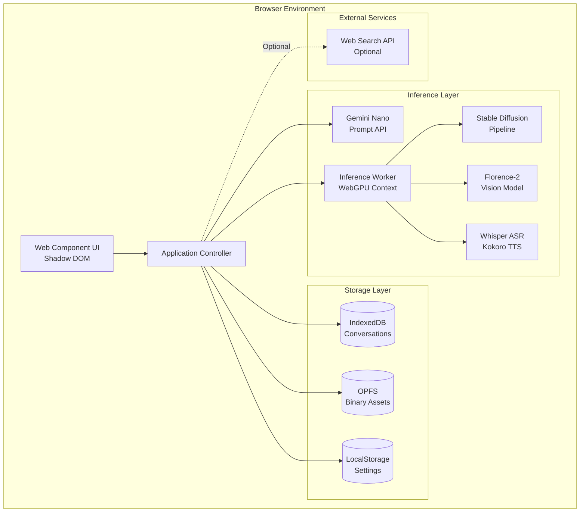

# Design Document: Local AI Assistant

## Overview

The Local AI Assistant is a privacy-first, browser-based conversational AI system that executes entirely on the user's device. The architecture leverages Chrome's built-in Gemini Nano model for text generation, WebGPU for hardware-accelerated multimodal inference, and browser storage APIs for persistent state management. By eliminating server-side dependencies, the system provides zero-latency responses, absolute data privacy, and offline functionality.

The system is designed as a modular Web Component that can function both as a standalone Progressive Web App (PWA) and as an embeddable widget on third-party websites. The architecture prioritizes incremental loading, hardware-aware feature gating, and graceful degradation to ensure broad device compatibility.

## Architecture

### High-Level System Architecture



### Component Responsibilities

**Web Component UI Layer**
- Encapsulates all visual elements within a closed Shadow DOM
- Handles user input events (text, voice, file uploads)
- Renders streaming responses with incremental Markdown parsing
- Manages thread navigation and settings interface

**Application Controller**
- Orchestrates communication between UI and inference layers
- Manages Prompt API session lifecycle (create, clone, destroy)
- Implements hardware capability detection and feature gating
- Coordinates storage operations across IndexedDB and OPFS

**Inference Worker**
- Executes heavy ML models in a separate thread to prevent UI blocking
- Manages WebGPU context and memory allocation
- Implements model weight caching and progressive loading
- Handles inference cancellation via AbortController

**Storage Layer**
- IndexedDB: Stores structured conversation data, thread metadata, and settings
- OPFS: Stores large binary assets (images, audio) with high-performance access
- LocalStorage: Caches small configuration flags for synchronous access

## Components and Interfaces

### 1. GeminiController

**Purpose:** Manages the lifecycle of Gemini Nano sessions and streaming responses.

**Interface:**
```typescript
interface GeminiController {
  // Check if the model is available
  checkAvailability(): Promise<ModelAvailability>;
  
  // Create a new session with configuration
  createSession(config: SessionConfig): Promise<AISession>;
  
  // Send a prompt and receive streaming response
  promptStreaming(session: AISession, prompt: string): AsyncIterable<string>;
  
  // Destroy a session to free memory
  destroySession(session: AISession): Promise<void>;
  
  // Clone a session for branching conversations
  cloneSession(session: AISession): Promise<AISession>;
}

interface SessionConfig {
  temperature: number;  // 0.0 to 1.0
  topK: number;         // Number of top tokens to consider
  systemPrompt?: string;
}

interface ModelAvailability {
  status: 'readily' | 'after-download' | 'no';
  downloadProgress?: number;  // 0 to 100
}
```

**Key Behaviors:**
- Polls `ai.languageModel.capabilities()` during initialization
- Monitors context window usage via session token counting
- Implements automatic context summarization when approaching limits
- Handles streaming interruption via AbortController

### 2. StorageManager

**Purpose:** Provides a unified interface for persisting conversations and assets.

**Interface:**
```typescript
interface StorageManager {
  // Conversation operations
  saveMessage(threadId: string, message: Message): Promise<void>;
  loadThread(threadId: string): Promise<Message[]>;
  listThreads(): Promise<ThreadMetadata[]>;
  deleteThread(threadId: string): Promise<void>;
  
  // Asset operations
  saveAsset(assetId: string, data: Blob): Promise<void>;
  loadAsset(assetId: string): Promise<Blob>;
  
  // Storage management
  requestPersistence(): Promise<boolean>;
  getStorageEstimate(): Promise<StorageEstimate>;
  clearAllData(): Promise<void>;
}

interface Message {
  id: string;
  threadId: string;
  role: 'user' | 'assistant';
  content: string;
  timestamp: number;
  attachments?: Attachment[];
}

interface Attachment {
  type: 'image' | 'document' | 'audio';
  assetId: string;
  metadata: Record<string, any>;
}

interface ThreadMetadata {
  id: string;
  title: string;
  lastMessageTime: number;
  messageCount: number;
}
```

**Key Behaviors:**
- Uses Dexie.js wrapper for IndexedDB operations
- Implements optimistic updates for immediate UI feedback
- Routes large files (>1MB) to OPFS, small data to IndexedDB
- Monitors storage quota and triggers cleanup warnings

### 3. InferenceWorkerManager

**Purpose:** Manages Web Workers for GPU-accelerated model inference.

**Interface:**
```typescript
interface InferenceWorkerManager {
  // Initialize worker with model type
  initializeWorker(modelType: ModelType): Promise<WorkerHandle>;
  
  // Execute inference task
  runInference(handle: WorkerHandle, task: InferenceTask): Promise<InferenceResult>;
  
  // Monitor progress for long-running tasks
  onProgress(callback: (progress: number) => void): void;
  
  // Cancel ongoing inference
  cancelInference(handle: WorkerHandle): Promise<void>;
  
  // Terminate worker and free resources
  terminateWorker(handle: WorkerHandle): Promise<void>;
}

type ModelType = 'image-generation' | 'vision' | 'speech-asr' | 'speech-tts';

interface InferenceTask {
  type: ModelType;
  input: string | Blob | ArrayBuffer;
  parameters: Record<string, any>;
}

interface InferenceResult {
  type: ModelType;
  output: string | Blob | ArrayBuffer;
  metadata: Record<string, any>;
}
```

**Key Behaviors:**
- Maintains a pool of workers (max 2 concurrent to prevent memory exhaustion)
- Implements progressive model weight loading with caching
- Uses SharedArrayBuffer for zero-copy data transfer when available
- Monitors GPU memory usage via WebGPU adapter queries

### 4. HardwareDiagnostics

**Purpose:** Detects device capabilities and gates features accordingly.

**Interface:**
```typescript
interface HardwareDiagnostics {
  // Detect all hardware capabilities
  detectCapabilities(): Promise<HardwareProfile>;
  
  // Check if a specific feature is supported
  canSupport(feature: Feature): boolean;
  
  // Get recommended settings for current hardware
  getRecommendedSettings(): FeatureSettings;
}

interface HardwareProfile {
  ram: number;              // GB
  cpuCores: number;
  storageAvailable: number; // GB
  gpuVRAM: number;          // GB (estimated)
  webGPUSupported: boolean;
}

type Feature = 'text-chat' | 'image-generation' | 'vision' | 'speech' | 'video';

interface FeatureSettings {
  enabledFeatures: Feature[];
  imageResolution: '512x512' | '768x768' | '1024x1024';
  maxContextLength: number;
}
```

**Key Behaviors:**
- Runs benchmark on first initialization to measure GPU performance
- Caches hardware profile in LocalStorage for subsequent loads
- Displays visual warnings when enabling features beyond hardware limits
- Automatically disables high-resource features on low-end devices

### 5. RAGProcessor

**Purpose:** Implements document ingestion and retrieval for context-aware responses.

**Interface:**
```typescript
interface RAGProcessor {
  // Ingest a document and create searchable chunks
  ingestDocument(file: File): Promise<DocumentHandle>;
  
  // Retrieve relevant chunks for a query
  retrieveContext(query: string, documentIds: string[]): Promise<Chunk[]>;
  
  // Delete a document and its chunks
  deleteDocument(documentId: string): Promise<void>;
}

interface DocumentHandle {
  id: string;
  filename: string;
  chunkCount: number;
}

interface Chunk {
  documentId: string;
  content: string;
  startOffset: number;
  endOffset: number;
  relevanceScore: number;
}
```

**Key Behaviors:**
- Chunks documents into 512-token segments with 50-token overlap
- Uses simple keyword matching for retrieval (no embeddings to minimize complexity)
- Stores chunks in IndexedDB with full-text search indices
- Limits context injection to top 3 most relevant chunks

## Data Models

### Conversation Thread Schema

```typescript
interface Thread {
  id: string;                    // UUID v4
  title: string;                 // Auto-generated from first message
  createdAt: number;             // Unix timestamp
  updatedAt: number;             // Unix timestamp
  messageCount: number;
  settings: ThreadSettings;
}

interface ThreadSettings {
  temperature: number;
  topK: number;
  systemPrompt: string;
  enabledFeatures: Feature[];
}
```

### Message Schema

```typescript
interface Message {
  id: string;                    // UUID v4
  threadId: string;              // Foreign key to Thread
  role: 'user' | 'assistant' | 'system';
  content: string;               // Markdown-formatted text
  timestamp: number;             // Unix timestamp
  attachments: Attachment[];
  metadata: MessageMetadata;
}

interface MessageMetadata {
  tokenCount?: number;
  inferenceTimeMs?: number;
  modelVersion?: string;
  citedSources?: string[];       // URLs or document references
}
```

### Asset Schema (OPFS)

```typescript
interface Asset {
  id: string;                    // UUID v4
  type: 'image' | 'audio' | 'document';
  mimeType: string;
  sizeBytes: number;
  createdAt: number;
  metadata: AssetMetadata;
}

interface AssetMetadata {
  width?: number;                // For images
  height?: number;               // For images
  durationMs?: number;           // For audio
  generationParams?: Record<string, any>;  // For generated content
}
```

### IndexedDB Schema

```typescript
// Database: LocalAIAssistant, Version: 1

// Object Store: threads
{
  keyPath: 'id',
  indexes: [
    { name: 'updatedAt', keyPath: 'updatedAt' }
  ]
}

// Object Store: messages
{
  keyPath: 'id',
  indexes: [
    { name: 'threadId', keyPath: 'threadId' },
    { name: 'timestamp', keyPath: 'timestamp' }
  ]
}

// Object Store: documents
{
  keyPath: 'id',
  indexes: [
    { name: 'filename', keyPath: 'filename' }
  ]
}

// Object Store: chunks
{
  keyPath: 'id',
  indexes: [
    { name: 'documentId', keyPath: 'documentId' },
    { name: 'content', keyPath: 'content', fullText: true }
  ]
}

// Object Store: settings
{
  keyPath: 'key'
}
```

## Error Handling

### Error Categories and Recovery Strategies

**1. Model Unavailability Errors**
- **Cause:** Browser flags not enabled, insufficient storage, or unsupported device
- **Detection:** `ai.languageModel.capabilities()` returns 'no'
- **Recovery:** Display setup instructions with links to chrome://flags
- **User Action Required:** Yes

**2. Memory Exhaustion Errors**
- **Cause:** GPU out of memory during inference
- **Detection:** WebGPU throws `GPUOutOfMemoryError`
- **Recovery:** Terminate current worker, reduce batch size, retry with lower resolution
- **User Action Required:** Optional (suggest closing tabs)

**3. Storage Quota Errors**
- **Cause:** IndexedDB or OPFS quota exceeded
- **Detection:** `QuotaExceededError` exception
- **Recovery:** Prompt user to delete old threads, offer automatic cleanup of oldest 10%
- **User Action Required:** Yes

**4. Network Errors (Web Search)**
- **Cause:** Search API unreachable or rate-limited
- **Detection:** Fetch timeout or HTTP 429/503
- **Recovery:** Fallback to model's built-in knowledge, display warning banner
- **User Action Required:** No

**5. Inference Timeout Errors**
- **Cause:** Model taking too long (>60s for text, >120s for images)
- **Detection:** Custom timeout wrapper around inference calls
- **Recovery:** Cancel inference, suggest reducing complexity or context length
- **User Action Required:** Yes

### Error Logging Strategy

All errors are logged to the browser console with structured metadata:

```typescript
interface ErrorLog {
  timestamp: number;
  category: ErrorCategory;
  message: string;
  stack?: string;
  context: {
    modelType?: ModelType;
    hardwareProfile?: HardwareProfile;
    storageUsed?: number;
  };
}
```

Critical errors (model unavailability, storage corruption) are also persisted to IndexedDB for debugging and displayed in a "System Health" panel in settings.

## Testing Strategy

### Dual Testing Approach

The Local AI Assistant requires both **unit tests** and **property-based tests** to ensure correctness across the wide variety of hardware configurations and user inputs.

**Unit Tests** focus on:
- Specific examples of correct behavior (e.g., "creating a thread generates a valid UUID")
- Edge cases (e.g., empty messages, malformed files)
- Integration points between components (e.g., StorageManager ↔ IndexedDB)
- Error conditions (e.g., quota exceeded, GPU unavailable)

**Property-Based Tests** focus on:
- Universal properties that hold for all inputs (e.g., "for any message, saving then loading returns equivalent content")
- Comprehensive input coverage through randomization
- Invariants that must be preserved (e.g., "thread message count always equals actual message count")

### Property-Based Testing Configuration

**Framework:** We will use **fast-check** (for TypeScript/JavaScript), which is the standard PBT library for the browser environment.

**Configuration:**
- Minimum 100 iterations per property test
- Each test must include a comment tag: `// Feature: local-ai-assistant, Property N: <property text>`
- Tests run in both Node.js (for CI) and browser (for WebGPU tests)

**Test Organization:**
```
tests/
├── unit/
│   ├── gemini-controller.test.ts
│   ├── storage-manager.test.ts
│   └── hardware-diagnostics.test.ts
├── properties/
│   ├── storage-properties.test.ts
│   ├── session-properties.test.ts
│   └── rag-properties.test.ts
└── integration/
    ├── end-to-end.test.ts
    └── worker-communication.test.ts
```

### Testing Challenges

**Challenge 1: WebGPU Availability**
- WebGPU is not available in Node.js test environments
- **Solution:** Use conditional test execution with `test.skipIf(!navigator.gpu)`
- **Solution:** Mock WebGPU adapter for unit tests, use real GPU for integration tests

**Challenge 2: Prompt API Availability**
- Gemini Nano only available in Chrome 127+ with flags enabled
- **Solution:** Mock the `window.ai` interface for unit tests
- **Solution:** Provide a "test mode" that uses a simple echo model for CI

**Challenge 3: Storage Persistence**
- IndexedDB and OPFS are asynchronous and stateful
- **Solution:** Use in-memory implementations for unit tests
- **Solution:** Clear all data in `beforeEach` hooks for property tests

**Challenge 4: Non-Deterministic Inference**
- LLM outputs vary even with temperature=0
- **Solution:** Test structural properties (e.g., "response is non-empty") rather than exact content
- **Solution:** Use fixed seeds for image generation tests when available


## Correctness Properties

*A property is a characteristic or behavior that should hold true across all valid executions of a system—essentially, a formal statement about what the system should do. Properties serve as the bridge between human-readable specifications and machine-verifiable correctness guarantees.*

The following properties define the correctness criteria for the Local AI Assistant. Each property is universally quantified and must hold for all valid inputs within its domain.

### Property 1: Version Validation Correctness

*For any* browser version number, the version check should correctly identify versions >= 127 as compatible and versions < 127 as incompatible.

**Validates: Requirements 1.1, 1.5**

### Property 2: Storage Threshold Validation

*For any* storage amount, the storage check should correctly identify amounts >= 22 GB as sufficient and amounts < 22 GB as insufficient, displaying appropriate warnings.

**Validates: Requirements 1.3, 1.6**

### Property 3: Session Lifecycle Management

*For any* sequence of conversations, creating a new conversation should destroy the previous session (if one exists) and create a new session with the specified configuration parameters.

**Validates: Requirements 3.1, 3.5**

### Property 4: Streaming Incremental Rendering

*For any* stream of response chunks, each chunk should appear in the UI incrementally as it arrives, maintaining correct Markdown rendering throughout.

**Validates: Requirements 3.3, 14.1, 14.2**

### Property 5: Context Window Management

*For any* conversation that exceeds the context window limit, the system should automatically summarize or truncate older messages to maintain the conversation within the limit.

**Validates: Requirements 3.4**

### Property 6: Error Handling Consistency

*For any* inference error, the system should display a user-friendly error message in the UI and log detailed technical information to the console.

**Validates: Requirements 3.6, 15.4**

### Property 7: Storage Round-Trip Consistency

*For any* data item (message, thread, document, image, setting), storing it then immediately retrieving it should return data equivalent to the original.

**Validates: Requirements 4.1, 4.2, 4.5, 7.5, 9.6, 10.6, 12.3, 12.4**

### Property 8: Thread Identifier Uniqueness

*For any* number of threads created, all thread identifiers should be unique (no collisions).

**Validates: Requirements 4.4, 13.2**

### Property 9: Style Isolation

*For any* CSS styles applied to the host page, those styles should not affect the appearance of elements within the assistant's Shadow DOM.

**Validates: Requirements 5.3**

### Property 10: Configuration API Validity

*For any* valid configuration object provided by the host page, the assistant should accept and apply the configuration without errors.

**Validates: Requirements 5.5**

### Property 11: Resource Loading Headers

*For any* resource fetch request made by the assistant, the request should include appropriate CORS headers for cross-origin compatibility.

**Validates: Requirements 5.6**

### Property 12: Hardware-Based Feature Gating

*For any* hardware profile that falls below the requirements for a feature, attempting to enable that feature should display a warning and either prevent activation or show a performance disclaimer.

**Validates: Requirements 6.5, 6.6, 7.6**

### Property 13: Worker Non-Blocking Execution

*For any* inference task (image generation, speech processing), executing the task in a worker should not block the main thread, keeping the UI responsive.

**Validates: Requirements 7.2, 7.3, 8.5**

### Property 14: Image Generation Output

*For any* valid text prompt, image generation should produce a valid image blob that can be rendered to a canvas element.

**Validates: Requirements 7.4**

### Property 15: Audio Processing Pipeline

*For any* audio input, the ASR model should produce a text transcription that appears in the chat input field.

**Validates: Requirements 8.2, 8.3**

### Property 16: TTS Output Generation

*For any* text response with voice output enabled, the TTS model should generate audio that plays through the browser's audio system.

**Validates: Requirements 8.4, 8.6**

### Property 17: Document Chunking Validity

*For any* uploaded text document, the chunking algorithm should produce chunks that are all within the maximum token limit and have appropriate overlap between consecutive chunks.

**Validates: Requirements 9.2**

### Property 18: Retrieval Relevance

*For any* query against uploaded documents, all retrieved chunks should contain at least one term from the query (basic relevance criterion).

**Validates: Requirements 9.3**

### Property 19: Context Injection Completeness

*For any* response generated with external context (documents, images, or search results), the prompt sent to the model should include the relevant context data.

**Validates: Requirements 9.4, 10.3, 11.2**

### Property 20: Source Citation Presence

*For any* response generated using external context (documents or search results), the response should include citations to the source material.

**Validates: Requirements 9.5, 11.3**

### Property 21: Vision Model Output

*For any* uploaded image, the vision model should generate a non-empty caption or description.

**Validates: Requirements 10.2**

### Property 22: Object Detection Visualization

*For any* image with detected objects, bounding boxes should be rendered as visual overlays with coordinates matching the detection output.

**Validates: Requirements 10.5**

### Property 23: Conditional Search API Calls

*For any* query when web search is enabled, the system should call the search API; when web search is disabled, no search API calls should be made.

**Validates: Requirements 11.1, 11.5**

### Property 24: Search Status Indicator

*For any* active search operation when web search is enabled, a visual indicator should be displayed in the UI.

**Validates: Requirements 11.6**

### Property 25: Settings Persistence

*For any* valid settings configuration, changing a setting should persist it to storage, and reloading the application should restore that setting.

**Validates: Requirements 12.3, 12.4**

### Property 26: Data Clearing Completeness

*For any* state where data exists in storage, executing the clear data operation should remove all data from both IndexedDB and OPFS.

**Validates: Requirements 12.6**

### Property 27: Thread List Completeness

*For any* set of threads in storage, the thread list UI should display all threads with their titles and last message timestamps.

**Validates: Requirements 13.1, 13.6**

### Property 28: Thread Message Ordering

*For any* selected thread, all messages should be loaded and displayed in chronological order (sorted by timestamp).

**Validates: Requirements 13.3**

### Property 29: Thread Deletion Completeness

*For any* thread, deleting it should remove the thread and all associated messages from storage, making them non-retrievable.

**Validates: Requirements 13.4**

### Property 30: Thread Title Generation

*For any* new thread with at least one user message, the thread title should be automatically generated from the first user message content.

**Validates: Requirements 13.5**

### Property 31: Stream Cancellation

*For any* active streaming response, sending a new message should cancel the current stream and call the appropriate abort method.

**Validates: Requirements 14.4, 14.5**

### Property 32: Stream Completion Persistence

*For any* completed streaming response, the message should be marked as complete in storage.

**Validates: Requirements 14.6**

### Edge Cases

The following edge cases should be handled gracefully by the implementation:

- **Incomplete Code Blocks**: When streaming Markdown content, incomplete code blocks (missing closing backticks) should not break the UI rendering (Requirement 14.3)
- **Empty Messages**: Attempting to send an empty message should be prevented or handled gracefully
- **Malformed Files**: Uploading corrupted or malformed files should trigger appropriate error messages
- **GPU Context Loss**: Sudden GPU context loss should trigger reinitialization attempts
- **Storage Corruption**: Corrupted IndexedDB data should be detected and trigger recovery options

### Unit Test Examples

The following specific examples should be covered by unit tests:

- **API Availability Check**: Verify that `window.ai.languageModel` presence is correctly detected (Requirement 1.2)
- **Model Status Handling**: Test UI behavior for each model status: "readily", "after-download", "no" (Requirements 2.2, 2.3, 2.4, 2.5, 2.6)
- **Hardware Display**: Verify that hardware metrics are correctly displayed in the settings UI (Requirements 6.1, 6.2, 6.3, 6.4)
- **Web Component Structure**: Verify the component is registered with a custom tag and has a closed Shadow DOM (Requirements 5.1, 5.2, 5.4)
- **Feature Toggles**: Verify that feature toggles exist and correctly enable/disable features (Requirement 12.2)
- **Clear Data Button**: Verify the clear data button exists and triggers the cleanup operation (Requirement 12.5)
- **Model Loading**: Verify that appropriate models are loaded for image generation and vision tasks (Requirements 7.1, 10.1)
- **Audio Capture**: Verify that the MediaDevices API is called when voice input is activated (Requirement 8.1)
- **File Reading**: Verify that the File API correctly reads uploaded text files (Requirement 9.1)
- **Search Toggle**: Verify that the web search toggle exists and changes the search state (Requirement 11.4)
- **Error Messages**: Verify specific error messages for model load failures, memory issues, and quota exceeded (Requirements 15.1, 15.2, 15.3, 15.5, 15.6)
