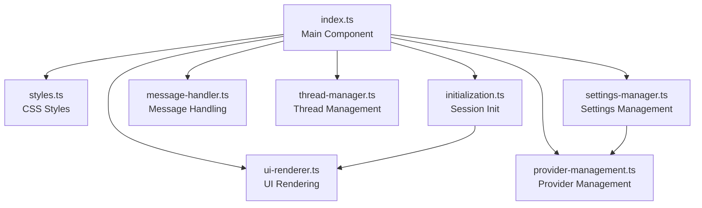

# Design Document: Refactor Local AI Assistant Component

## Overview

This design document outlines the refactoring of the monolithic `local-ai-assistant.ts` file (2,485 lines) into a modular, maintainable structure. The refactoring will extract logical components into separate modules within a dedicated `src/local-ai-assistant/` folder while preserving all existing functionality and maintaining the component's public API.

The refactoring follows the Single Responsibility Principle, separating concerns into focused modules that are easier to understand, test, and maintain. The main component will act as an orchestrator, delegating specific responsibilities to specialized modules.

## Architecture

### Current Structure (Before Refactoring)

```
src/
└── local-ai-assistant.ts (2,485 lines)
    ├── Imports (20 lines)
    ├── LocalAIAssistant class
    │   ├── Private fields (40 lines)
    │   ├── Constructor (30 lines)
    │   ├── initializeComponent() with embedded CSS (1,000 lines)
    │   ├── Settings methods (300 lines)
    │   ├── Initialization methods (400 lines)
    │   ├── UI rendering methods (500 lines)
    │   ├── Message handling methods (200 lines)
    │   ├── Thread management methods (300 lines)
    │   └── Lifecycle methods (20 lines)
    └── Component registration (5 lines)
```

### Target Structure (After Refactoring)

```
src/local-ai-assistant/
├── index.ts (300 lines)              # Main orchestrator component
├── styles.ts (1,000 lines)           # CSS styles
├── initialization.ts (400 lines)     # Session initialization
├── ui-renderer.ts (500 lines)        # Status messages & guides
├── message-handler.ts (200 lines)    # Message operations
├── thread-manager.ts (300 lines)     # Thread CRUD operations
├── settings-manager.ts (300 lines)   # Settings panel logic
└── provider-management.ts (200 lines) # Provider UI & recovery
```

### Module Dependency Graph



## Components and Interfaces

### 1. Main Component (index.ts)

**Purpose:** Orchestrates all modules and maintains component state.

**Responsibilities:**
- Web Component lifecycle management
- State management (all private fields)
- Dependency injection to modules
- Event handler coordination
- Shadow DOM creation and management

**Interface:**
```typescript
export class LocalAIAssistant extends HTMLElement {
  // All existing private fields remain here
  private shadow: ShadowRoot;
  private chatUI: ChatUI | null = null;
  private settingsUI: SettingsUI | null = null;
  private threadListUI: ThreadListUI | null = null;
  private geminiController: GeminiController;
  private providerManager: ProviderManager;
  private recoveryManager: RecoveryManager;
  private storageManager: StorageManager;
  private activeProvider: ModelProvider | null = null;
  private currentSession: ChatSession | null = null;
  private abortController: AbortController | null = null;
  private messageIdCounter = 0;
  private initMessageId: string | null = null;
  private hardwareProfile: HardwareProfile | null = null;
  private currentThreadId: string | null = null;
  private headerText: HTMLElement | null = null;
  private currentSettings: SettingsConfig;

  constructor();
  connectedCallback(): void;
  disconnectedCallback(): void;
}
```

**Key Behaviors:**
- Delegates to modules via function calls
- Passes state as parameters
- Receives updates via callbacks or return values
- Maintains single source of truth for all state

### 2. Styles Module (styles.ts)

**Purpose:** Provides all CSS styles for the Shadow DOM.

**Interface:**
```typescript
/**
 * Returns the complete CSS styles for the Local AI Assistant component
 * Includes all layout, component, animation, and responsive styles
 */
export function getComponentStyles(): string;
```

**Exported Function:**
```typescript
export function getComponentStyles(): string {
  return `
    :host { ... }
    .ai-assistant-container { ... }
    /* All existing CSS rules */
  `;
}
```

**Key Behaviors:**
- Returns complete CSS as a single string
- Includes all animations (fadeIn, blink, pulse, spin)
- Maintains all existing class names and selectors
- No runtime dependencies

### 3. Initialization Module (initialization.ts)

**Purpose:** Handles session initialization and provider fallback logic.

**Interface:**
```typescript
export interface InitializationContext {
  chatUI: ChatUI;
  geminiController: GeminiController;
  providerManager: ProviderManager;
  hardwareProfile: HardwareProfile | null;
  currentSettings: SettingsConfig;
  initMessageId: string;
  messageIdCounter: number;
}

export interface InitializationResult {
  activeProvider: ModelProvider | null;
  currentSession: ChatSession | null;
  messageIdCounter: number;
}

/**
 * Initialize the AI session by detecting and setting up the best available provider
 */
export async function initializeSession(
  context: InitializationContext
): Promise<InitializationResult>;

/**
 * Attempt to initialize WebLLM as a fallback when Chrome AI is unavailable
 */
export async function tryWebLLMFallback(
  context: InitializationContext,
  chromeAvailability?: DetailedAvailability
): Promise<InitializationResult>;

/**
 * Start model download for Chrome provider
 */
export async function startModelDownload(
  context: InitializationContext
): Promise<InitializationResult>;
```

**Key Behaviors:**
- Pure functions that accept context and return results
- No hidden state or side effects beyond UI updates
- Delegates UI rendering to ui-renderer module
- Returns updated state to main component

### 4. UI Renderer Module (ui-renderer.ts)

**Purpose:** Generates formatted status messages and troubleshooting guides.

**Interface:**
```typescript
/**
 * Render initialization status message with steps
 */
export function renderInitializationStatus(
  steps: InitStep[],
  status: 'checking' | 'success' | 'failed' | 'downloading',
  availability?: DetailedAvailability,
  downloadPercent?: number
): string;

/**
 * Render fallback status when trying alternative providers
 */
export function renderFallbackStatus(
  steps: InitStep[],
  status: 'checking' | 'downloading' | 'failed',
  chromeAvailability?: DetailedAvailability
): string;

/**
 * Generate troubleshooting guide based on failure reason
 */
export function getTroubleshootingGuide(
  reason: DetailedAvailability['reason']
): string;

/**
 * Generate browser-specific setup guide when no provider is available
 */
export function getNoProviderGuide(
  chromeReason?: DetailedAvailability['reason']
): string;
```

**Key Behaviors:**
- Pure functions that transform data into markdown strings
- No DOM manipulation or side effects
- Browser detection logic for contextual guides
- Consistent markdown formatting

### 5. Message Handler Module (message-handler.ts)

**Purpose:** Manages message sending, streaming, and persistence.

**Interface:**
```typescript
export interface MessageContext {
  chatUI: ChatUI;
  storageManager: StorageManager;
  activeProvider: ModelProvider | null;
  currentSession: ChatSession | null;
  currentThreadId: string | null;
  messageIdCounter: number;
  recoveryManager: RecoveryManager;
}

export interface MessageResult {
  messageIdCounter: number;
  currentThreadId: string | null;
  abortController: AbortController | null;
}

/**
 * Handle sending a user message and streaming the assistant's response
 */
export async function handleSendMessage(
  content: string,
  context: MessageContext
): Promise<MessageResult>;

/**
 * Cancel the current streaming response
 */
export function handleCancelStream(
  abortController: AbortController | null
): void;

/**
 * Save a message to the current thread
 */
export async function saveMessageToThread(
  message: Message,
  threadId: string | null,
  storageManager: StorageManager,
  currentSettings: SettingsConfig
): Promise<string>; // Returns threadId (creates if null)
```

**Key Behaviors:**
- Manages streaming lifecycle
- Handles error recovery via ErrorHandler
- Creates threads on-demand
- Returns updated state to main component

### 6. Thread Manager Module (thread-manager.ts)

**Purpose:** Handles all thread CRUD operations and UI updates.

**Interface:**
```typescript
export interface ThreadContext {
  chatUI: ChatUI;
  threadListUI: ThreadListUI;
  storageManager: StorageManager;
  headerText: HTMLElement | null;
  currentThreadId: string | null;
  messageIdCounter: number;
}

export interface ThreadResult {
  currentThreadId: string | null;
  messageIdCounter: number;
}

/**
 * Generate a unique thread ID using UUID v4
 */
export function generateThreadId(): string;

/**
 * Generate a thread title from the first user message
 */
export function generateThreadTitle(firstMessage: string): string;

/**
 * Create a new thread
 */
export async function createNewThread(
  firstMessage: string | undefined,
  context: Pick<ThreadContext, 'storageManager'>,
  currentSettings: SettingsConfig
): Promise<string>;

/**
 * Toggle thread list sidebar visibility
 */
export async function toggleThreadList(
  context: Pick<ThreadContext, 'threadListUI' | 'storageManager' | 'currentThreadId'>
): Promise<void>;

/**
 * Handle thread selection
 */
export async function handleThreadSelect(
  threadId: string,
  context: ThreadContext
): Promise<ThreadResult>;

/**
 * Handle thread deletion
 */
export async function handleThreadDelete(
  threadId: string,
  context: ThreadContext
): Promise<ThreadResult>;

/**
 * Handle new thread creation
 */
export async function handleNewThread(
  context: ThreadContext
): Promise<ThreadResult>;
```

**Key Behaviors:**
- Pure functions for ID and title generation
- Async functions for storage operations
- Updates UI components directly
- Returns updated state to main component

### 7. Settings Manager Module (settings-manager.ts)

**Purpose:** Manages settings panel creation, population, and updates.

**Interface:**
```typescript
export interface SettingsContext {
  shadow: ShadowRoot;
  settingsUI: SettingsUI | null;
  providerManager: ProviderManager;
  activeProvider: ModelProvider | null;
  currentSession: ChatSession | null;
  currentSettings: SettingsConfig;
  hardwareProfile: HardwareProfile | null;
  chatUI: ChatUI | null;
  storageManager: StorageManager;
  messageIdCounter: number;
}

export interface SettingsResult {
  settingsUI: SettingsUI | null;
  activeProvider: ModelProvider | null;
  currentSession: ChatSession | null;
  currentSettings: SettingsConfig;
  messageIdCounter: number;
}

/**
 * Create the settings panel DOM structure
 */
export function createSettingsPanel(
  shadow: ShadowRoot,
  onToggle: () => void
): HTMLElement;

/**
 * Toggle settings panel visibility
 */
export function toggleSettings(
  shadow: ShadowRoot,
  onShow: () => Promise<void>
): void;

/**
 * Populate the provider list in settings
 */
export async function populateProviderList(
  context: SettingsContext,
  callbacks: {
    onProviderSwitch: (name: string) => Promise<void>;
    onSettingsChange: (config: SettingsConfig) => void;
    onClearData: () => Promise<void>;
    onResetApplication: () => Promise<void>;
  }
): Promise<SettingsUI | null>;

/**
 * Switch to a different provider
 */
export async function switchProvider(
  providerName: string,
  context: SettingsContext
): Promise<SettingsResult>;

/**
 * Handle settings changes
 */
export async function handleSettingsChange(
  config: SettingsConfig,
  context: SettingsContext
): Promise<SettingsConfig>;

/**
 * Clear all data
 */
export async function clearAllData(
  context: Pick<SettingsContext, 'storageManager' | 'chatUI' | 'shadow'>,
  messageIdCounter: number
): Promise<number>;
```

**Key Behaviors:**
- Creates DOM elements for settings panel
- Validates settings against hardware capabilities
- Persists settings to storage
- Returns updated state to main component

### 8. Provider Management Module (provider-management.ts)

**Purpose:** Manages provider indicator UI and recovery operations.

**Interface:**
```typescript
export interface ProviderContext {
  shadow: ShadowRoot;
  chatUI: ChatUI | null;
  activeProvider: ModelProvider | null;
  currentSession: ChatSession | null;
  recoveryManager: RecoveryManager;
  messageIdCounter: number;
}

export interface ProviderResult {
  currentSession: ChatSession | null;
  messageIdCounter: number;
}

/**
 * Update the provider indicator in the header
 */
export function updateProviderIndicator(
  shadow: ShadowRoot,
  provider: ModelProvider
): void;

/**
 * Handle GPU recovery after context loss
 */
export async function handleGPURecovery(
  context: ProviderContext
): Promise<ProviderResult>;

/**
 * Handle application reset
 */
export async function handleApplicationReset(
  recoveryManager: RecoveryManager
): Promise<void>;

/**
 * Trigger application reset (called from UI)
 */
export async function resetApplication(
  recoveryManager: RecoveryManager
): Promise<void>;
```

**Key Behaviors:**
- Updates DOM elements for provider display
- Handles GPU context loss recovery
- Coordinates with RecoveryManager
- Returns updated state to main component

## Data Models

All data models remain unchanged from the original implementation. The refactoring only reorganizes code, not data structures.

## Module Communication Patterns

### Pattern 1: Context Objects

Modules receive all necessary dependencies via context objects:

```typescript
// Main component prepares context
const context: MessageContext = {
  chatUI: this.chatUI,
  storageManager: this.storageManager,
  activeProvider: this.activeProvider,
  currentSession: this.currentSession,
  currentThreadId: this.currentThreadId,
  messageIdCounter: this.messageIdCounter,
  recoveryManager: this.recoveryManager
};

// Module function receives context
const result = await handleSendMessage(content, context);

// Main component updates state from result
this.messageIdCounter = result.messageIdCounter;
this.currentThreadId = result.currentThreadId;
this.abortController = result.abortController;
```

### Pattern 2: Callback Functions

For operations that need to call back to the main component:

```typescript
// Main component provides callbacks
await populateProviderList(context, {
  onProviderSwitch: async (name) => await this.switchProvider(name),
  onSettingsChange: (config) => this.handleSettingsChange(config),
  onClearData: async () => await this.clearAllData(),
  onResetApplication: async () => await this.resetApplication()
});
```

### Pattern 3: Pure Functions

For stateless transformations:

```typescript
// No context needed, just data in/out
const markdown = renderInitializationStatus(steps, 'success', availability);
const threadId = generateThreadId();
const title = generateThreadTitle(message);
```

## Migration Strategy

### Phase 1: Extract Styles
1. Create `styles.ts` with `getComponentStyles()` function
2. Update `index.ts` to import and use styles
3. Verify Shadow DOM styling works identically

### Phase 2: Extract UI Renderer
1. Create `ui-renderer.ts` with rendering functions
2. Update `index.ts` to import and use renderer
3. Verify all status messages render correctly

### Phase 3: Extract Initialization
1. Create `initialization.ts` with init functions
2. Update `index.ts` to import and use initialization
3. Verify provider detection and session creation work

### Phase 4: Extract Message Handler
1. Create `message-handler.ts` with message functions
2. Update `index.ts` to import and use handler
3. Verify message streaming and persistence work

### Phase 5: Extract Thread Manager
1. Create `thread-manager.ts` with thread functions
2. Update `index.ts` to import and use manager
3. Verify thread CRUD operations work

### Phase 6: Extract Settings Manager
1. Create `settings-manager.ts` with settings functions
2. Update `index.ts` to import and use manager
3. Verify settings panel and configuration work

### Phase 7: Extract Provider Management
1. Create `provider-management.ts` with provider functions
2. Update `index.ts` to import and use management
3. Verify provider indicator and recovery work

### Phase 8: Update Imports
1. Update all files importing `local-ai-assistant.ts`
2. Change imports to `local-ai-assistant/index.ts`
3. Verify application builds and runs

## Testing Strategy

### Unit Testing Approach

Each extracted module will be easier to unit test in isolation:

**Before Refactoring:**
```typescript
// Hard to test - requires full component setup
test('should generate thread title', () => {
  const component = new LocalAIAssistant();
  // Complex setup required...
});
```

**After Refactoring:**
```typescript
// Easy to test - pure function
test('should generate thread title', () => {
  const title = generateThreadTitle('This is a very long message...');
  expect(title).toBe('This is a very long message...');
});
```

### Integration Testing

The main component integration tests remain unchanged - they test the public API which is preserved.

### Property-Based Testing

Extracted pure functions are ideal candidates for property-based testing:

```typescript
// Feature: refactor-local-ai-assistant, Property 1: Thread ID uniqueness
test('generated thread IDs are always unique', () => {
  fc.assert(
    fc.property(fc.integer({ min: 1, max: 1000 }), (count) => {
      const ids = new Set<string>();
      for (let i = 0; i < count; i++) {
        ids.add(generateThreadId());
      }
      return ids.size === count;
    }),
    { numRuns: 100 }
  );
});
```

## Correctness Properties

*A property is a characteristic or behavior that should hold true across all valid executions of a system—essentially, a formal statement about what the system should do. Properties serve as the bridge between human-readable specifications and machine-verifiable correctness guarantees.*

### Property 1: Module Function Purity

*For any* pure function in the extracted modules (generateThreadId, generateThreadTitle, render functions), calling the function multiple times with the same inputs should produce equivalent outputs (except for UUID generation which is intentionally random).

**Validates: Requirements 9.3, 12.4**

### Property 2: State Preservation

*For any* operation that extracts and calls a module function, the main component's state before and after should only differ in the explicitly returned values from that function.

**Validates: Requirements 9.1, 9.2, 10.1**

### Property 3: Import Path Consistency

*For any* file that imports from the refactored component, the import should resolve successfully and provide the same exported symbols as before.

**Validates: Requirements 11.1, 11.2, 11.3**

### Property 4: Functionality Equivalence

*For any* public method or behavior of LocalAIAssistant, the behavior after refactoring should be functionally equivalent to the behavior before refactoring.

**Validates: Requirements 10.1, 10.2, 10.3, 10.4, 10.5, 10.6, 10.7, 10.8, 10.9, 10.10**

### Property 5: Module Independence

*For any* extracted module, the module should not maintain hidden state or have side effects beyond those explicitly documented in its interface.

**Validates: Requirements 9.3, 9.4**

### Property 6: Type Safety Preservation

*For any* TypeScript type annotation in the original code, the refactored code should maintain the same level of type safety and type checking.

**Validates: Requirements 12.4, 12.5**

## Error Handling

All error handling patterns remain unchanged. Errors are still:
- Caught at the same points
- Processed by the same ErrorHandler
- Displayed to users in the same way
- Logged to console with the same detail

The refactoring only moves code, it doesn't change error handling logic.

## Performance Considerations

The refactoring should have minimal performance impact:

**Positive Impacts:**
- Smaller module files may load faster
- Better tree-shaking opportunities
- Easier code splitting in the future

**Neutral Impacts:**
- Function call overhead is negligible
- Context object creation is lightweight
- No additional async operations introduced

**Monitoring:**
- Verify bundle size doesn't increase significantly
- Check that initialization time remains the same
- Ensure message streaming latency is unchanged
