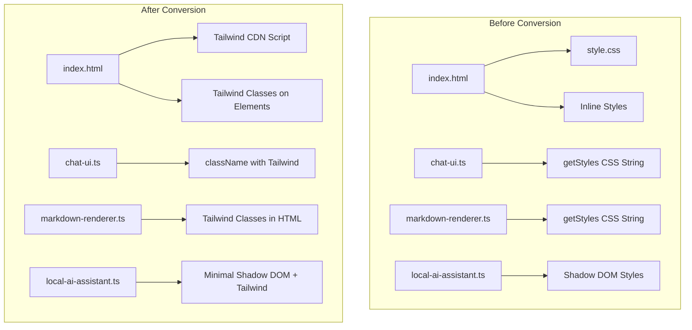

# Design Document: Tailwind CSS Conversion

## Overview

This design document outlines the approach for converting all CSS in the Local AI Assistant project from traditional CSS (external stylesheets and inline style strings) to Tailwind CSS utility classes. The conversion will use Tailwind CSS v4's browser runtime loaded directly from CDN, eliminating the need for build-time CSS processing.

The conversion follows a component-by-component approach, ensuring each module is fully converted before moving to the next. This maintains a working application throughout the migration process.

## Architecture

### High-Level Architecture



### Tailwind CDN Integration

The Tailwind CSS browser runtime will be loaded via a script tag in `index.html`:

```html
<script src="https://cdn.jsdelivr.net/npm/@tailwindcss/browser@4"></script>
```

This provides:
- Zero build configuration
- Instant availability of all Tailwind utility classes
- JIT-like behavior in the browser
- Support for arbitrary values using bracket notation

### Shadow DOM Considerations

Web Components using Shadow DOM require special handling since Tailwind's CDN script operates on the main document. The approach:

1. Keep minimal CSS in Shadow DOM for animations that can't be expressed with Tailwind
2. Use Tailwind classes on elements within Shadow DOM (they work because the browser runtime processes them)
3. For complex animations, define `@keyframes` in a minimal `<style>` block

## Components and Interfaces

### 1. Index HTML Structure

**Before:**
```html
<style>
  body { margin: 0; padding: 20px; ... }
  .demo-container { max-width: 800px; ... }
</style>
```

**After:**
```html
<script src="https://cdn.jsdelivr.net/npm/@tailwindcss/browser@4"></script>
<body class="m-0 p-5 font-sans bg-gray-100">
  <div class="max-w-3xl mx-auto">
    <h1 class="text-center text-gray-800">...</h1>
    <local-ai-assistant class="h-[600px] block"></local-ai-assistant>
  </div>
</body>
```

### 2. ChatUI Component Interface

**Current Interface:**
```typescript
class ChatUI {
    static getStyles(): string;  // Returns CSS string
    private createMessageList(): HTMLElement;
    private createInputContainer(): HTMLElement;
    // ...
}
```

**New Interface:**
```typescript
class ChatUI {
    // getStyles() method REMOVED
    private createMessageList(): HTMLElement;  // Uses Tailwind classes
    private createInputContainer(): HTMLElement;  // Uses Tailwind classes
    // ...
}
```

### 3. MarkdownRenderer Component Interface

**Current Interface:**
```typescript
class MarkdownRenderer {
    static render(markdown: string): string;
    static getStyles(): string;  // Returns CSS string
}
```

**New Interface:**
```typescript
class MarkdownRenderer {
    static render(markdown: string): string;  // Injects Tailwind classes
    // getStyles() method REMOVED
}
```

### 4. LocalAIAssistant Component Interface

**Current Interface:**
```typescript
class LocalAIAssistant extends HTMLElement {
    private initializeComponent(): void;  // Creates style element with CSS
}
```

**New Interface:**
```typescript
class LocalAIAssistant extends HTMLElement {
    private initializeComponent(): void;  // Minimal style + Tailwind classes
}
```

## Data Models

### Tailwind Class Mappings

The following mappings define the conversion from CSS properties to Tailwind classes:

#### Layout Classes
| CSS Property | Tailwind Class |
|-------------|----------------|
| `display: flex` | `flex` |
| `flex-direction: column` | `flex-col` |
| `align-items: center` | `items-center` |
| `justify-content: center` | `justify-center` |
| `gap: 8px` | `gap-2` |
| `gap: 12px` | `gap-3` |
| `gap: 16px` | `gap-4` |

#### Spacing Classes
| CSS Property | Tailwind Class |
|-------------|----------------|
| `padding: 12px` | `p-3` |
| `padding: 16px` | `p-4` |
| `padding: 12px 16px` | `py-3 px-4` |
| `margin: 0 auto` | `mx-auto` |
| `margin: 8px 0` | `my-2` |

#### Sizing Classes
| CSS Property | Tailwind Class |
|-------------|----------------|
| `width: 100%` | `w-full` |
| `height: 100%` | `h-full` |
| `max-width: 800px` | `max-w-3xl` |
| `max-height: 150px` | `max-h-[150px]` |
| `min-height: 44px` | `min-h-[44px]` |

#### Color Classes
| CSS Color | Tailwind Class |
|-----------|----------------|
| `#3b82f6` | `bg-blue-500` / `text-blue-500` |
| `#2563eb` | `bg-blue-600` / `hover:bg-blue-600` |
| `#f3f4f6` | `bg-gray-100` |
| `#f9fafb` | `bg-gray-50` |
| `#1e1e1e` | `bg-gray-900` |
| `#6b7280` | `text-gray-500` |
| `#9ca3af` | `text-gray-400` |
| `#111827` | `text-gray-900` |

#### Border Classes
| CSS Property | Tailwind Class |
|-------------|----------------|
| `border-radius: 8px` | `rounded-lg` |
| `border-radius: 12px` | `rounded-xl` |
| `border-radius: 50%` | `rounded-full` |
| `border: 1px solid #e5e7eb` | `border border-gray-200` |
| `border-top: 1px solid #e5e7eb` | `border-t border-gray-200` |

#### Typography Classes
| CSS Property | Tailwind Class |
|-------------|----------------|
| `font-size: 14px` | `text-sm` |
| `font-size: 12px` | `text-xs` |
| `font-weight: 600` | `font-semibold` |
| `line-height: 1.5` | `leading-normal` |
| `font-family: system-ui` | `font-sans` |

### Animation Definitions

Custom animations that cannot be expressed with Tailwind's built-in utilities:

```css
/* Minimal CSS for Shadow DOM */
@keyframes fadeIn {
    from { opacity: 0; transform: translateY(10px); }
    to { opacity: 1; transform: translateY(0); }
}

@keyframes blink {
    0%, 100% { opacity: 1; }
    50% { opacity: 0.3; }
}

.animate-fadeIn {
    animation: fadeIn 0.3s ease-in;
}

.animate-blink {
    animation: blink 1.5s ease-in-out infinite;
}
```

Tailwind built-in animations to use:
- `animate-pulse` - for status indicator
- `animate-spin` - for loading spinner


## Correctness Properties

*A property is a characteristic or behavior that should hold true across all valid executions of a system—essentially, a formal statement about what the system should do. Properties serve as the bridge between human-readable specifications and machine-verifiable correctness guarantees.*

### Property 1: ChatUI Elements Have Tailwind Classes

*For any* DOM element created by the ChatUI class (message-list, message, message-avatar, message-content, input-container, message-input, send-button, loading-indicator), the element's className should contain valid Tailwind utility classes and should NOT contain legacy CSS class names that require external stylesheets.

**Validates: Requirements 3.2, 3.3, 3.4, 3.5, 3.6, 3.7, 3.8, 3.9, 3.10**

### Property 2: Markdown Renderer Output Contains Tailwind Classes

*For any* valid markdown input, when rendered by MarkdownRenderer.render(), the output HTML should contain Tailwind utility classes on block-level elements (headers, code blocks, lists, paragraphs) rather than relying on external CSS selectors.

**Validates: Requirements 4.2, 4.3, 4.4, 4.5, 4.6, 4.7, 4.8**

### Property 3: LocalAIAssistant Container Elements Have Tailwind Classes

*For any* container element within the LocalAIAssistant Shadow DOM (ai-assistant-container, ai-assistant-header, status-indicator, ai-assistant-content, ai-assistant-footer), the element's className should contain valid Tailwind utility classes for layout, spacing, and visual styling.

**Validates: Requirements 5.2, 5.3, 5.4, 5.5, 5.6**

### Property 4: Animated Elements Have Animation Classes

*For any* element that should be animated (messages with fadeIn, status indicator with pulse, loading spinner with spin, incomplete code blocks with blink), the element should have either a Tailwind animation class (animate-pulse, animate-spin) or a custom animation class defined in minimal CSS.

**Validates: Requirements 7.1, 7.2, 7.3, 7.4, 7.5**

### Property 5: Colored Elements Use Tailwind Color Classes

*For any* element with a specific color (user message background, assistant message background, header gradient, code block background, links), the element's className should contain the corresponding Tailwind color utility class (bg-blue-500, bg-gray-100, bg-gray-900, text-blue-500, etc.).

**Validates: Requirements 8.1, 8.2, 8.3, 8.4, 8.5**

### Property 6: Interactive Elements Have Focus Utilities

*For any* interactive element (message-input textarea, send-button, links), the element's className should contain Tailwind focus utilities (focus:ring, focus:border-*, focus:outline-*) to maintain accessibility.

**Validates: Requirements 10.1, 10.2, 10.3**

## Error Handling

### Missing Tailwind CDN

If the Tailwind CDN script fails to load:
- Elements will still render with their semantic structure
- Styling will be degraded but functional
- Console warning should be logged

### Shadow DOM Style Isolation

If Tailwind classes don't apply within Shadow DOM:
- Fallback to minimal inline styles for critical layout
- Ensure component remains functional without full styling

### Invalid Tailwind Classes

If invalid Tailwind classes are used:
- Browser will ignore unknown classes
- No runtime errors will occur
- Visual appearance may differ from expected

## Testing Strategy

### Unit Tests

Unit tests will verify specific examples and edge cases:

1. **CDN Script Presence**: Verify index.html contains the Tailwind CDN script tag
2. **Style File Removal**: Verify style.css import is removed from main.ts
3. **Method Removal**: Verify getStyles() methods are removed from ChatUI and MarkdownRenderer
4. **Shadow DOM Minimal CSS**: Verify LocalAIAssistant style element contains only animation keyframes

### Property-Based Tests

Property-based tests will use fast-check to verify universal properties:

1. **ChatUI Tailwind Classes**: Generate various ChatUI configurations and verify all elements have Tailwind classes
2. **Markdown Rendering**: Generate various markdown inputs and verify output contains Tailwind classes
3. **Color Consistency**: Generate elements with colors and verify correct Tailwind color classes
4. **Focus State Presence**: Generate interactive elements and verify focus utilities are present

### Test Configuration

- Property-based tests: minimum 100 iterations per property
- Test framework: Vitest with fast-check
- Tag format: **Feature: tailwind-css-conversion, Property {number}: {property_text}**

### Integration Tests

1. **Visual Regression**: Compare rendered output before and after conversion
2. **Animation Verification**: Verify animations play correctly
3. **Responsive Behavior**: Verify layout adapts to different viewport sizes
